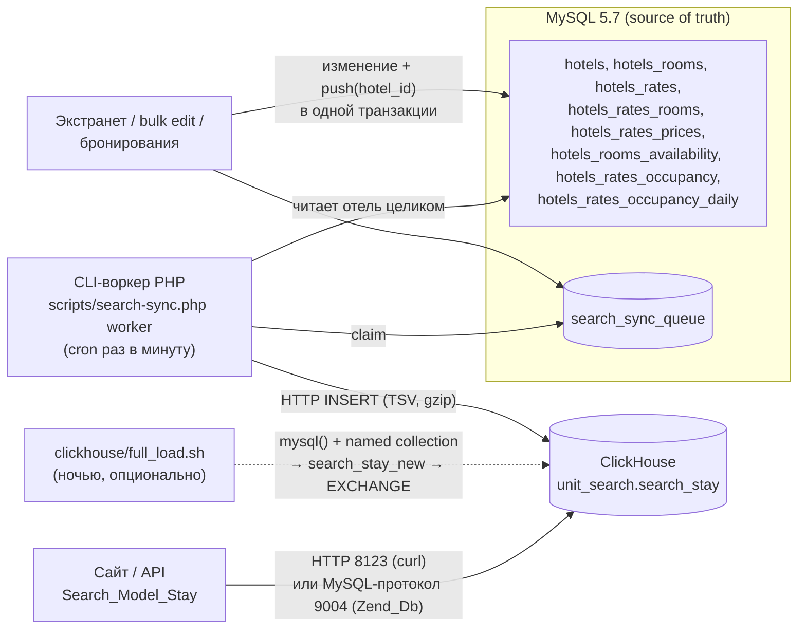

# Unit.Travel — поисковый слой на ClickHouse

Поисковый кэш для инвентори-системы отелей Unit.Travel (PHP 5 + ZF1 + MySQL 5.7).
MySQL остаётся источником истины; в ClickHouse лежат готовые данные для поиска, которые читаются без JOIN.

Кэш отвечает на два запроса:

1. **Выдача по направлению** — минимальная цена за проживание по 500–1000 отелям для дат заезда/выезда и числа гостей.
2. **Карточка отеля** — все доступные рум-рейты выбранного отеля на эти даты и число гостей, с ценами по ночам.

Всё в этой папке проверено на PHP 5.6.40 + Zend Framework 1.12.20 + MySQL 5.7.44 + ClickHouse 24.8 (результаты — в разделе «Проверка»).

---

## 1. Архитектура



**Главная идея — нарастающие суммы.** Одна строка `search_stay` = один рум-рейт на одну дату горизонта `[сегодня; сегодня + 365]`.
В строке хранится `c{g}(d)` — сумма цен продаваемых ночей *до* даты `d` для `g` гостей, и `k(d)` — сколько таких ночей было до `d`. Тогда для проживания `[checkin; checkout)`:

* цена = `c{g}(checkout) − c{g}(checkin)`;
* все ночи продаются ⇔ `k(checkout) − k(checkin) = nights`.

Поэтому поиск читает **2 строки на рум-рейт при любой длине проживания**, а ограничения (CTA, min/max LOS, min/max ADV) берутся из строки даты заезда, CTD — из строки даты выезда.

## 2. Что в папке

| Файл | Назначение |
|---|---|
| `mysql/00_recommended_indexes.sql` | Составные UNIQUE-индексы из анализа (ускоряют сборщик, защищают от дублей). Не обязательно, но рекомендуется |
| `mysql/01_search_sync_queue.sql` | Таблица очереди `search_sync_queue` |
| `mysql/02_demo_data.sql` | Генератор демо-данных: 2000 отелей × 3–5 номеров × 3–4 тарифа × 365 дней (цены, наличие, надбавки, дневные цены на гостей) |
| `mysql/03_demo_cleanup.sql` | Удаление демо-данных (строго по сохранённым диапазонам id) |
| `clickhouse/01_schema.sql` | База `unit_search`, таблица `search_stay` |
| `clickhouse/02_users.sql` | Пользователи `search_writer` (синхронизация) и `search_reader` (сайт) |
| `clickhouse/config.d/unit_mysql.xml` | Подключение ClickHouse → MySQL для полной загрузки без PHP |
| `clickhouse/03_full_load_from_mysql.sql`, `03b_build_chunk.sql`, `04_full_load_swap.sql`, `full_load.sh` | Полная пересборка силами ClickHouse (~50 с на 2000 отелей) |
| `library/Search/ClickHouse/*` | Клиент ClickHouse: `Client` + транспорты `Transport_Http` (curl) и `Transport_Mysql` (Zend_Db, порт 9004) |
| `library/Search/Model/Stay.php` | Модель поиска: `search()` и `hotelRates()` |
| `library/Search/Sync/*` | Синхронизация: `Queue` (очередь в MySQL), `Builder` (MySQL → строки кэша), `Worker` |
| `scripts/search-sync.php` (+ `.config.php.dist`) | CLI синхронизации |
| `application/controllers/SearchController.php` | Пример ZF1-контроллера (JSON API) |
| `tests/*` | Проверки: эталон «в лоб», сквозной тест очереди, сравнение транспортов, бенчмарк, smoke-тест контроллера; `inject_duplicates.sql` — дубли строк для проверки на стенде |

Код совместим с PHP 5.4+ (только `array()`, без `??`, скалярных тайпхинтов и т.п.), классы названы по соглашению ZF1 (`Search_Model_Stay` → `library/Search/Model/Stay.php`) и подключаются автозагрузчиком `Zend_Loader_Autoloader::getInstance()->registerNamespace('Search_')`.

## 3. Развёртывание (сначала на стейдже)

```bash
# --- MySQL
mysql -u... -p... tezdynamix < mysql/01_search_sync_queue.sql
mysql -u... -p... tezdynamix < mysql/00_recommended_indexes.sql   # по желанию, см. комментарии в файле
mysql -u... -p... tezdynamix < mysql/02_demo_data.sql              # демо: ~1-3 мин, 7.2 млн цен, 2.3 млн наличия

# --- ClickHouse
cp clickhouse/config.d/unit_mysql.xml /etc/clickhouse-server/config.d/    # вписать хост/логин MySQL (нужен только SELECT)
clickhouse-client --multiquery < clickhouse/01_schema.sql
clickhouse-client --multiquery < clickhouse/02_users.sql                  # после config.d: там GRANT на named collection

# --- первичная загрузка кэша (любой из двух способов)
CH="clickhouse-client --user search_writer --password ..." clickhouse/full_load.sh   # силами ClickHouse, ~50 с
php scripts/search-sync.php full                                                     # силами PHP-воркера, ~3 мин

# --- PHP
cp scripts/search-sync.config.php.dist scripts/search-sync.config.php   # MySQL, ClickHouse (search_writer), timezone
php scripts/search-sync.php stats
```

Cron (на одной машине — CLI держит `flock`, два воркера одновременно не запустятся):

```cron
* * * * *   php /var/www/unit/scripts/search-sync.php worker 55        # разбирать очередь
5 0 * * *   php /var/www/unit/scripts/search-sync.php enqueue-all nightly   # сдвиг горизонта на новый день + сверка
0 */2 * * * php /var/www/unit/scripts/search-sync.php optimize           # склеить версии строк (см. «Эксплуатация»)
```

Удалить демо: `mysql ... < mysql/03_demo_cleanup.sql` (3–8 мин, удаляет пачками), затем `php scripts/search-sync.php hotels <first_id>-<last_id>` (id печатает генератор) — удалённые отели получат tombstone-строки и пропадут из поиска.

## 4. Правила расчёта (что считается «доступно» и «сколько стоит»)

Одни и те же правила реализованы трижды — в `Search_Sync_Builder` (PHP), в `clickhouse/03b_build_chunk.sql` (SQL) и в эталоне `tests/reference.php`, и все три дают одинаковый результат.

* **В поиск попадает рум-рейт**, если активны отель, номер и тариф (`active = 1`) и есть связь в `hotels_rates_rooms`.
* **Базовая цена ночи:**
  * самостоятельный тариф — строка `hotels_rates_prices` с `active = 1` и `price IS NOT NULL`, иначе ночь не продаётся;
  * производный тариф (`id_parent > 0`): своя строка с `active = 0` → не продаётся; своя `price` при `derive_type = 0` → своя цена;
    иначе цена родителя на том же номере × `(100 + dv) / 100`, где `dv` = своя `derive_value` при `derive_type = 4`, иначе `−hotels_rates.derive_value`.
* **Наличие:** строка `hotels_rooms_availability`, иначе `allotment` номера, `net_booked = 0`, `active = 1`; продаётся, если `active = 1` и `allotment − net_booked > 0`.
* **Цена на g гостей** (g = 1..min(8, max(max_occupancy, base_occupancy))): при `pricing_model = 2` и наличии строки `hotels_rates_occupancy(rate_room, g)` — `active = 1` → база × (1 + amount/100), `active = 0` → на g гостей не продаётся; иначе базовая цена.
* **Дневная цена на g гостей** — `hotels_rates_occupancy_daily(rate_room, g, дата)` с `price > 0` при `pricing_model = 2`: цена этой ночи на g гостей = `price` (приоритет над процентом из `hotels_rates_occupancy`). Действует, только если ночь вообще продаётся (есть базовая цена, номер свободен) и g гостей не выключено; `price = 0` — «не задано».
* **Дубли строк** (в MySQL нет UNIQUE-ключей, дубли создаёт, например, ошибка пагинации bulk edit): для цены, наличия, надбавки и дневной цены берётся строка с **максимальным id**, целиком. Лучше закрыть дубли ключами из `mysql/00_recommended_indexes.sql`.
* **Ограничения** даты берутся из своей строки цены рум-рейта, иначе из тарифа: `min_los`/`min_adv` (NULL → значение тарифа), `max_los`/`max_adv` (0 или NULL → без ограничения), `cta`/`ctd`. Проверяются по дате заезда (CTA, LOS, ADV) и дате выезда (CTD).
* **Округление** целочисленное half up в копейках — PHP и ClickHouse дают одинаковые суммы до копейки.
* Все цены — в валюте отеля (`currency_id`); поиск сортирует по цене внутри одной валюты.

**Нужно подтвердить с бизнесом** (реализовано так, как показано выше, меняется в одном месте каждой реализации):
1. Производный тариф наследует у родителя цену, но не ограничения (CTA/CTD/LOS) — ограничения только свои или тарифа.
2. `min_los` проверяется по дню заезда (как у Booking.com «arrival-based»). Если нужна проверка по каждой ночи — нарастающие суммы это не покрывают, нужна отдельная доработка.
3. Нет строки надбавки на g гостей → базовая цена; строка с `active = 0` → на g гостей не продаётся.
4. Дети/возраст не учитываются — пока только общее число гостей.
5. Разные валюты: для сортировки выдачи по цене между странами нужен курс (удобно словарём ClickHouse `dictGet`).
6. `hotels_rates_occupancy_daily`: дневная цена — абсолютная цена ночи на g гостей и заменяет процент; работает только для `pricing_model = 2`; производный тариф её у родителя **не** наследует (только свои строки, как и проценты); ночь, закрытая по базовой цене, дневной ценой не открывается. Если таблица на самом деле хранит что-то другое (например, заранее посчитанные цены по всем датам или процент, как было в старой колонке `amount`), правило меняется в `Search_Sync_Builder`, `03b_build_chunk.sql` и `tests/reference.php`.

## 5. Синхронизация MySQL → ClickHouse через HTTP (текущий этап)

### Как устроено

1. **Очередь** `search_sync_queue` — одна строка на «грязный» отель. `Search_Sync_Queue::push($hotelId, 'reason')` идемпотентен: повторный вызов только увеличивает `version`.
2. **Воркер** (`Search_Sync_Worker::run()`, запускается `scripts/search-sync.php worker`) атомарно забирает пачку отелей (`UPDATE ... SET claimed_by = token ... LIMIT n`), пересобирает их **целиком** и удаляет из очереди только если `version` не изменилась за время сборки — изменение, пришедшее во время сборки, не теряется. Упавший воркер: через 10 минут отели заберёт следующий.
3. **Сборщик** (`Search_Sync_Builder::build()`) читает отели пачками по 10 (7 запросов на пачку, без JOIN по истории), считает строки по правилам из раздела 4 и отдаёт их готовыми TSV-строками — память PHP не растёт.
4. **Вставка**: `Search_ClickHouse_Client::insertTsv()` → `POST /?query=INSERT ... FORMAT TabSeparated`, тело сжато gzip, ~250 тыс. строк (≈50 отелей) на одну вставку. Одна вставка = один атомарный блок, поэтому отель никогда не виден наполовину.
5. **Версии**: все строки отеля в одной сборке получают один `ver`; `ReplacingMergeTree(ver, is_deleted)` оставляет последнюю версию, `SELECT ... FINAL` видит только её. Поиск дополнительно требует `min(ver) = max(ver)` для строк заезда и выезда.
6. **Удаления**: рум-рейты, которые были в ClickHouse, но больше не собираются (выключен тариф/номер/отель, удалена связь), получают tombstone-строки `is_deleted = 1`.

### Где ставить отель в очередь (задача для разработчиков)

`Search_Sync_Queue::getInstance()->push($hotelId, 'reason')` — желательно в той же транзакции MySQL, что и само изменение:

| Место в коде | Когда |
|---|---|
| `Hotels_Calendar_Bulkedit::doAction()` | после применения задачи bulk edit (цены, ограничения, наличие) |
| `Hotels_Calendar_Bulkedit_Grid::doCreate()` | не нужно: в кэш попадает только применённое воркером bulk edit |
| `Hotels_Rates_Grid::doSaveRate()`, удаление тарифа в `HotelsController::editrateAction()` | тариф: цена-родитель, скидка, каналы, видимость, привязка к номерам, min_los/min_adv |
| `Hotels_Rooms_Grid::save()`, удаление номера в `HotelsController::editroomAction()` | номер: allotment, вместимость, pricing_model, активность |
| `Hotels_Rates_Occupancy::doUpdate()` | надбавки за число гостей, base_occupancy |
| Всё, что пишет `hotels_rates_occupancy_daily` | дневные цены на число гостей (окно occupancy в календаре, bulk edit, API/channel manager) |
| `Hotels_Grid::save()` | отель: звёзды, регион, валюта, активность |
| Создание/отмена бронирования | изменение `net_booked` в `hotels_rooms_availability` |
| cron `enqueue-all` раз в сутки | сдвиг горизонта на новый день, сверка |

### Производительность синхронизации (PHP 5.6)

| Операция | Время |
|---|---|
| 1 отель (≈4 400 строк) | 67 мс |
| 50 отелей (≈256 тыс. строк) | 2,9–3,2 с |
| Все 2002 отеля (10,25 млн строк), PHP-воркер | 3 мин 15 с |
| Все 2002 отеля, силами ClickHouse (`full_load.sh`, с дедупликацией дублей) | 48 с |

## 6. Прямая связь MySQL ↔ ClickHouse без HTTP

**Чтение сайтом через MySQL-протокол ClickHouse (порт 9004)** — то, что по ссылке из документации. ClickHouse принимает подключения как MySQL-сервер, поэтому работает штатный `Zend_Db_Adapter_Pdo_Mysql`:

```php
Search_ClickHouse_Client::setDefault(Search_ClickHouse_Client::factory(array(
    'transport' => 'mysql', 'host' => 'clickhouse.internal', 'port' => 9004,
    'username' => 'search_reader', 'password' => '...', 'dbname' => 'unit_search',
)));
// или сырой Zend_Db:
$ch = Zend_Db::factory('Pdo_Mysql', array('host' => 'clickhouse.internal', 'port' => 9004, 'username' => 'search_reader',
    'password' => '...', 'dbname' => 'unit_search', 'charset' => 'utf8'));
$ch->fetchAll('SELECT hotel_id, count() FROM search_stay WHERE d = ? GROUP BY hotel_id', array('2026-12-10'));
```

Проверено: `fetchAll/fetchCol/fetchOne`, bind-параметры (PDO эмулирует prepared statements), `quoteInto` с массивами; ответы моделей через 9004 и через HTTP совпадают полностью, скорость одинаковая. Пользователь должен быть создан с `double_sha1_password` (см. `02_users.sql`). Ограничение: нет `INSERT ... FORMAT`, поэтому массовую запись воркера лучше оставить на HTTP.

**ClickHouse сам читает MySQL** (используется в `full_load.sh`):

* табличная функция `mysql(unit_mysql, table = 'hotels')` с named collection из `config.d/unit_mysql.xml` — пароль не хранится в SQL; нужны `SET mysql_datatypes_support_level = 'decimal'` (иначе DECIMAL придёт строкой) и права `MYSQL`, `NAMED COLLECTION`;
* тот же доступ можно оформить таблицей `ENGINE = MySQL(...)` или словарём с источником MySQL (`SOURCE(MYSQL(...)) LIFETIME(300)`) — удобно для справочников (валюты, курсы, типы питания);
* инкрементально так тоже можно (ClickHouse читает `search_sync_queue` и пересобирает отели SQL-ом), но логика очереди проще и прозрачнее в PHP — рекомендуем: инкрементально PHP-воркер, ночью или при сбоях — `full_load.sh`.

**Потоковая репликация (на будущее):** `MaterializedMySQL` в ClickHouse экспериментальный — для продакшена не рекомендуем. Если понадобится CDC — Debezium/Maxwell (binlog) → Kafka → ClickHouse (Kafka engine) или Altinity Sink Connector; но пересчёт нарастающих сумм всё равно нужен на уровне отеля, поэтому очередь «грязных» отелей остаётся.

## 7. Использование в PHP (ZF1)

Bootstrap (один раз):

```php
protected function _initClickHouse() {
    $config = new Zend_Config_Ini(APPLICATION_PATH . '/configs/application.ini', APPLICATION_ENV);
    Search_ClickHouse_Client::setDefault(Search_ClickHouse_Client::factory($config->clickhouse));
}
```

```ini
clickhouse.transport = "http"            ; или "mysql" (порт 9004)
clickhouse.host      = "clickhouse.internal"
clickhouse.port      = 8123
clickhouse.username  = "search_reader"
clickhouse.password  = "..."
clickhouse.dbname    = "unit_search"
clickhouse.timeout   = 3
clickhouse.settings.max_execution_time = 3
```

Поиск:

```php
$result = Search_Model_Stay::getInstance()->search(array(
    'checkin'   => '2026-12-10', 'nights' => 7,     // или 'checkout' => '2026-12-17'
    'guests'    => 2,
    'region_id' => 243836,                          // или 'hotel_ids' => array(...), 'country_id', 'city_id'
    'stars'     => array(4, 5), 'board_ids' => array(4, 7), 'refundable' => 1,   // необязательно
    'price_min' => 5000, 'price_max' => 20000,      // за всё проживание, в валюте отеля
    'order'     => 'price', 'limit' => 30, 'offset' => 0,
));
// array('total' => 492, 'items' => array(array('hotel_id' => 1554, 'price' => 9264, 'price_minor' => 926400,
//        'currency_id' => 46688, 'stars' => 4, 'rate_room_id' => 12010, 'room_id' => 3756, 'rate_id' => 3259,
//        'board_id' => 1, 'refundable' => 0, 'nights' => 7), ...))

$rates = Search_Model_Stay::getInstance()->hotelRates(1554, array('checkin' => '2026-12-10', 'nights' => 7, 'guests' => 2));
// array(array('rate_room_id' => .., 'room_id' => .., 'rate_id' => .., 'parent_rate_id' => .., 'board_id' => ..,
//        'refundable' => .., 'room_type_id' => .., 'max_guests' => .., 'currency_id' => .., 'rooms_left' => 4,
//        'price' => 10488.9, 'price_minor' => 1048890, 'nightly' => array(1344, 1451.52, ...)), ...)
```

Прямые запросы к ClickHouse из своих моделей:

```php
// календарь доступности отеля: сколько рум-рейтов продаётся в каждую ночь и сколько номеров свободно
class Search_Model_HotelAvailability extends Search_Model_Abstract {
    public function byDay($hotelId, $from, $to) {
        return $this->_client->fetchAll('SELECT s.d AS d, countIf(s.avail > 0) AS sellable_rate_rooms,
                max(s.avail) AS max_rooms_left
            FROM search_stay AS s FINAL
            WHERE s.d IN (' . $this->_dateList($from, $to) . ') AND s.hotel_id = ' . $this->_int($hotelId) . '
            GROUP BY s.d ORDER BY s.d');
    }
}
```

Цена одной ночи — это разность нарастающих сумм соседних дат (`c{g}(d + 1) − c{g}(d)`), поэтому для цен используйте
`search()`/`hotelRates()` или ту же разность, а не сами колонки `c1..c8`.

Правила для своих запросов: всегда `FINAL`; фильтр по `d` первым (ключ сортировки `(d, hotel_id, rate_room_id)`), для диапазона дат одного отеля — явный список `d IN (...)`; в `WHERE` квалифицировать колонки алиасом таблицы, если в `SELECT` есть алиасы с теми же именами; в SQL подставлять только `_int()`, `_intList()`, `_date()`, `_dateList()`. Перед бронированием цену и наличие **обязательно** перепроверять в MySQL: кэш отстаёт на секунды.

Пример JSON API — `application/controllers/SearchController.php` (`/search/hotels`, `/search/hotel`): 400 на неверные параметры, 503 без подробностей, если ClickHouse недоступен.

## 8. Проверка (что и как проверено)

Окружение: Docker, 4 ядра; PHP 5.6.40 + ZF 1.12.20, MySQL 5.7.44 (дамп + демо), ClickHouse 24.8.

| Проверка | Результат |
|---|---|
| `tests/verify_reference.php` — эталон «в лоб» по ночам из MySQL против `hotelRates()`/`search()` | текущая версия: 800 случаев, 3 910 цен рум-рейтов с разбивкой по ночам (из них 416 ночей по дневной цене на гостей), 15 наборов × 50 отелей, 15 наборов фильтров с проверкой сортировки, в т.ч. 300 случаев на 100 отелях с дублями строк — **0 расхождений** |
| `tests/compare_php_vs_sql_build.sql` — PHP-сборщик против SQL-сборки ClickHouse | 10 252 392 строки, все колонки — **идентичны** (EXCEPT DISTINCT в обе стороны + хеш всех строк), в т.ч. с 350 912 дневными ценами и ~20 тыс. дублей строк (`tests/inject_duplicates.sql`) |
| `tests/queue_flow.php` — изменение в MySQL → очередь → воркер → кэш | цена BAR (+производный), выключение тарифа (tombstone), private-тариф, стоп-продажа, выключение отеля, изменение во время сборки, дневная цена на 3 гостей и `price = 0`, дубль строки цены, полный откат — **всё OK** |
| `tests/compare_transports.php` — HTTP 8123 против MySQL-протокола 9004 | ответы совпадают полностью |
| `tests/controller_smoke.php` — `SearchController` через `Zend_Controller_Front` | 200 / 400 / 503 — OK |
| `mysql/03_demo_cleanup.sql` | база вернулась ровно к исходному дампу |

Скорость (`tests/bench_search.php`, из PHP 5.6, полное время вызова метода, данные после `OPTIMIZE`):

| Запрос | p50 | p95 |
|---|---|---|
| `search()` регион, ~1000 отелей, 7 ночей, 2 гостя | 17–19 мс | 19–22 мс |
| `search()` 1000 `hotel_ids` | 21–22 мс | 25 мс |
| `search()` 14 ночей, 3 гостя, 4–5*, BB/HB, возвратные | 16–17 мс | 18–19 мс |
| `search()` все результаты (limit 1000) | 22–23 мс | 26–29 мс |
| `hotelRates()` один отель, 7 ночей | 15–16 мс | 16–19 мс |

Объём: 10,25 млн строк кэша = 272 МБ на диске ClickHouse (970 МБ без сжатия); в MySQL демо-цены занимают 1,25 ГБ.

Запуск тестов: `SEARCH_SYNC_CONFIG=/path/config.php php tests/verify_reference.php 200` (конфиг как у `search-sync.php` + секция `reader` для пользователя `search_reader`).

## 9. Эксплуатация

* **OPTIMIZE.** Пока у строк есть несклеенные старые версии, `FINAL` сливает их на лету: на тех же данных поиск шёл 34–43 мс вместо 17–23 мс. Фоновые слияния ClickHouse постепенно это делают сами; `optimize` (≈5 с на 10 млн строк) раз в 1–3 часа и в конце `full_load.sh` держит скорость стабильной.
* **Часовой пояс.** Горизонт считается от «сегодня» PHP (`timezone` в конфиге) и ClickHouse (`today()` в `full_load.sh`) — они должны совпадать. Часы серверов синхронизировать (NTP): `ver` — это время сборки.
* **Мониторинг:** `php scripts/search-sync.php stats` — длина очереди, самый старый элемент, ошибки (`last_error`); алерт, если `oldest` старше 5 минут.
* **Безопасность:** сайт ходит в ClickHouse только пользователем `search_reader` (`readonly`, лимит 3 с на запрос); `search_writer` — только для CLI. Модели не подставляют в SQL ничего, кроме приведённых к int значений и проверенных дат.
* **Горизонт** — 365 ночей (`Search_Sync_Builder::HORIZON_DAYS`), до 8 гостей (`MAX_GUESTS`). Старые даты удаляет `TTL d + 1 DAY`.

## 10. Чек-лист задачи для разработчиков

1. Развернуть ClickHouse (один сервер, 8–16 ГБ RAM достаточно на десятки тысяч отелей), применить `01_schema.sql`, `config.d/unit_mysql.xml`, `02_users.sql`.
2. Создать `search_sync_queue`; по желанию применить `00_recommended_indexes.sql` (через pt-osc/gh-ost).
3. Подключить `library/Search` в проект (автозагрузка `Search_`), клиент ClickHouse в Bootstrap, конфиг в `application.ini`.
4. Расставить `Search_Sync_Queue::push()` по местам из таблицы в разделе 5 (включая бронирования).
5. Настроить cron: `worker` раз в минуту, `enqueue-all` ночью, `optimize` раз в 1–3 часа; первичная загрузка — `full_load.sh`.
6. Подтвердить с бизнесом правила из раздела 4 (пункты 1–6) и при необходимости поправить сборщик и SQL-сборку **одновременно** (тесты `verify_reference.php` и `compare_php_vs_sql_build.sql` поймают расхождение).
7. Сделать выдачу и карточку отеля на `Search_Model_Stay` (пример — `SearchController`), контент отелей брать из своего кэша по id.
8. Перед бронированием — перепроверка цены и наличия в MySQL.
9. Прогнать `tests/*` на стейдже с демо-данными, затем удалить демо (`03_demo_cleanup.sql` + `search-sync.php hotels <ids>`).

Приёмка: `verify_reference.php` — 0 расхождений; `queue_flow.php` — ALL OK; поиск по ~1000 отелей p95 < 50 мс; задержка от изменения в экстранете до поиска < 2 минут.
