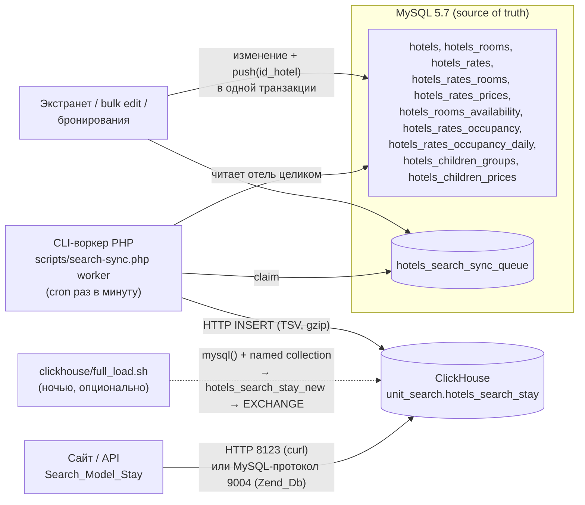

# Unit.Travel — поисковый слой на ClickHouse

Поисковый кэш для инвентори-системы отелей Unit.Travel (PHP 5 + ZF1 + MySQL 5.7).
MySQL остаётся источником истины; в ClickHouse лежат готовые данные для поиска, которые читаются без JOIN.

Кэш отвечает на два запроса:

1. **Выдача по направлению** — минимальная цена за проживание по 500–1000 отелям для дат заезда/выезда и состава гостей.
2. **Карточка отеля** — все доступные рум-рейты выбранного отеля на эти даты и состав гостей, с ценами по ночам.

Состав гостей — по номерам: взрослые + возраста детей, до 4 номеров в запросе. Тариф номера считается только за взрослых, дети — по детской политике (существующая кровать / доп. кровать, группы по возрасту, исключения по тарифу и датам), взрослые сверх `base_occupancy` в per room — с доплатой. Правила — раздел 5.

Всё в этой папке проверено на PHP 5.6.40 + Zend Framework 1.12.20 + MySQL 5.7.44 + ClickHouse 24.8 (результаты — в разделе «Проверка»).

---

## 1. Архитектура


```mermaid
flowchart LR
    subgraph MySQL["MySQL 5.7 (source of truth)"]
        T[hotels, hotels_rooms, hotels_rates,<br/>hotels_rates_rooms, hotels_rates_prices,<br/>hotels_rooms_availability, hotels_rates_occupancy,<br/>hotels_rates_occupancy_daily,<br/>hotels_children_groups, hotels_children_prices]
        Q[(hotels_search_sync_queue)]
    end
    A[Экстранет / bulk edit /<br/>бронирования] -- "изменение + push(id_hotel)<br/>в одной транзакции" --> T
    A --> Q
    W["CLI-воркер PHP<br/>scripts/search-sync.php worker<br/>(cron раз в минуту)"] -- claim --> Q
    W -- "читает отель целиком" --> T
    W -- "HTTP INSERT (TSV, gzip)" --> CH[("ClickHouse<br/>unit_search.hotels_search_stay")]
    F["clickhouse/full_load.sh<br/>(ночью, опционально)"] -. "mysql() + named collection<br/>→ hotels_search_stay_new → EXCHANGE" .-> CH
    S["Сайт / API<br/>Search_Model_Stay"] -- "HTTP 8123 (curl)<br/>или MySQL-протокол 9004 (Zend_Db)" --> CH
```

**Главная идея — нарастающие суммы.** Одна строка `hotels_search_stay` = один рум-рейт на одну дату горизонта `[сегодня; сегодня + 365]`.
В строке хранится `c{g}(d)` — сумма цен продаваемых ночей *до* даты `d` для `g` взрослых, и `k(d)` — сколько таких ночей было до `d`. Тогда для проживания `[checkin; checkout)`:

* цена = `c{g}(checkout) − c{g}(checkin)`;
* все ночи продаются ⇔ `k(checkout) − k(checkin) = nights`.

Так же хранятся нарастающие суммы цены ребёнка каждой возрастной группы на существующей и на доп. кровати (`cb[j]`, `ce[j]`) и число ночей, где свободно не меньше 2 / 3 / 4 номеров (`k2..k4`). Всё, что зависит от даты и тарифа (детские цены по календарю, «% от одноместной», доплата за доп. взрослого), считает сборщик; поиск только вычитает.

Поэтому поиск читает **2 строки на рум-рейт при любой длине проживания**, а ограничения (CTA, min/max LOS, min/max ADV) берутся из строки даты заезда, CTD — из строки даты выезда.

## 2. Что в папке

| Файл | Назначение |
|---|---|
| `mysql/00_recommended_indexes.sql` | Составные UNIQUE-индексы из анализа (ускоряют сборщик, защищают от дублей). Не обязательно, но рекомендуется |
| `mysql/01_hotels_search_sync_queue.sql` | Таблица очереди `hotels_search_sync_queue` |
| `mysql/01b_children_extra_beds.sql` | Дети и доп. кровати: `hotels.extra_bed_adult_price`, места номера (`places_regular`, `extra_beds`, `share_slots`), таблицы `hotels_children_groups` и `hotels_children_prices` |
| `mysql/02_demo_data.sql` | Генератор демо-данных: 2000 отелей × 3–5 номеров × 3–4 тарифа × 365 дней (цены, наличие, надбавки, дневные цены на гостей, детская политика, доп. кровати) |
| `mysql/03_demo_cleanup.sql` | Удаление демо-данных (строго по сохранённым диапазонам id) |
| `clickhouse/01_schema.sql` | База `unit_search`, таблица `hotels_search_stay` |
| `clickhouse/01b_upgrade_children.sql` | `ALTER` для таблицы, созданной до поддержки детей (после него — полная пересборка кэша) |
| `clickhouse/02_users.sql` | Пользователи `search_writer` (синхронизация) и `search_reader` (сайт) |
| `clickhouse/config.d/unit_mysql.xml` | Подключение ClickHouse → MySQL для полной загрузки без PHP |
| `clickhouse/03_full_load_from_mysql.sql`, `03b_build_chunk.sql`, `04_full_load_swap.sql`, `full_load.sh` | Полная пересборка силами ClickHouse (~1 мин на 2000 отелей вместе с OPTIMIZE) |
| `library/Search/ClickHouse/*` | Клиент ClickHouse: `Client` + транспорты `Transport_Http` (curl) и `Transport_Mysql` (Zend_Db, порт 9004) |
| `library/Search/Model/Stay.php` | Модель поиска: `search()`, `hotelRooms()` и `hotelRates()` |
| `library/Search/Occupancy.php` | Размещение в номере и цена (взрослые, дети, доп. кровати) и самая дешёвая комбинация нескольких номеров — для карточки отеля и перерасчёта брони |
| `library/Search/Sync/*` | Синхронизация: `Queue` (очередь в MySQL), `Builder` (MySQL → строки кэша), `Worker` |
| `scripts/search-sync.php` (+ `.config.php.dist`) | CLI синхронизации |
| `application/controllers/SearchController.php` | Пример ZF1-контроллера (JSON API) |
| `tests/*` | Проверки: эталон «в лоб», сквозной тест очереди, сравнение транспортов, бенчмарк, smoke-тест контроллера, `occupancy_unit.php` (размещение детей против полного перебора, без базы); `inject_duplicates.sql` — дубли строк для проверки на стенде |

**Имена.** Все новые таблицы — с префиксом `hotels_` (`hotels_search_stay`, `hotels_search_sync_queue`, `hotels_children_groups`, `hotels_children_prices`, `hotels_search_demo_registry`, staging `hotels_search_stg_*`), все поля-идентификаторы — `id_*`, как в ваших таблицах: `id_hotel`, `id_rate_room`, `id_room`, `id_rate`, `id_parent`, `id_country`, `id_region`, `id_city`, `id_currency`, `id_board_type`, `id_cancel_policy`, `id_room_type`, `id_access_group` (из `hotels_rates.access_group_id`). Так же названы ключи параметров поиска и ответов моделей.

Код совместим с PHP 5.4+ (только `array()`, без `??`, скалярных тайпхинтов и т.п.), классы названы по соглашению ZF1 (`Search_Model_Stay` → `library/Search/Model/Stay.php`) и подключаются автозагрузчиком `Zend_Loader_Autoloader::getInstance()->registerNamespace('Search_')`.

## 3. Развёртывание (сначала на стейдже)

```bash
# --- MySQL
mysql -u... -p... tezdynamix < mysql/01_hotels_search_sync_queue.sql
mysql -u... -p... tezdynamix < mysql/01b_children_extra_beds.sql   # новые поля отеля и номера, детские группы и цены
mysql -u... -p... tezdynamix < mysql/00_recommended_indexes.sql   # по желанию, см. комментарии в файле
mysql -u... -p... tezdynamix < mysql/02_demo_data.sql              # демо: ~2 мин, 7.2 млн цен, 2.3 млн наличия, детская политика

# --- ClickHouse
cp clickhouse/config.d/unit_mysql.xml /etc/clickhouse-server/config.d/    # вписать хост/логин MySQL (нужен только SELECT)
clickhouse-client --multiquery < clickhouse/01_schema.sql                 # уже есть таблица без детей: 01b_upgrade_children.sql
clickhouse-client --multiquery < clickhouse/02_users.sql                  # после config.d: там GRANT на named collection

# --- первичная загрузка кэша (любой из двух способов)
CH="clickhouse-client --user search_writer --password ..." clickhouse/full_load.sh   # силами ClickHouse, ~1,5 мин
php scripts/search-sync.php full                                                     # силами PHP-воркера, ~4 мин

# --- PHP
cp scripts/search-sync.config.php.dist scripts/search-sync.config.php   # MySQL, ClickHouse (search_writer), timezone
php scripts/search-sync.php stats
```

Cron (на одной машине — CLI держит `flock`, два воркера одновременно не запустятся):

```cron
* * * * *   php /var/www/unit/scripts/search-sync.php worker 55        # разбирать очередь
5 0 * * *   php /var/www/unit/scripts/search-sync.php enqueue-all nightly   # сдвиг горизонта на новый день + сверка
0 */2 * * * php /var/www/unit/scripts/search-sync.php optimize           # склеить версии строк (см. «Эксплуатация»)
```

Удалить демо: `mysql ... < mysql/03_demo_cleanup.sql` (3–8 мин, удаляет пачками), затем `php scripts/search-sync.php hotels <id_hotel_first>-<id_hotel_last>` (id печатает генератор) — удалённые отели получат tombstone-строки и пропадут из поиска.

## 4. Правила расчёта (что считается «доступно» и «сколько стоит»)

Одни и те же правила реализованы трижды — в `Search_Sync_Builder` (PHP), в `clickhouse/03b_build_chunk.sql` (SQL) и в эталоне `tests/reference.php`, и все три дают одинаковый результат.

* **В поиск попадает рум-рейт**, если активны отель, номер и тариф (`active = 1`) и есть связь в `hotels_rates_rooms`.
* **Базовая цена ночи:**
  * самостоятельный тариф — строка `hotels_rates_prices` с `active = 1` и `price IS NOT NULL`, иначе ночь не продаётся;
  * производный тариф (`id_parent > 0`): своя строка с `active = 0` → не продаётся; своя `price` при `derive_type = 0` → своя цена;
    иначе цена родителя на том же номере × `(100 + dv) / 100`, где `dv` = своя `derive_value` при `derive_type = 4`, иначе `−hotels_rates.derive_value`.
* **Наличие:** строка `hotels_rooms_availability`, иначе `allotment` номера, `net_booked = 0`, `active = 1`; продаётся, если `active = 1` и `allotment − net_booked > 0`.
* **Цена за g взрослых** (дети считаются отдельно, раздел 5):
  * per guest (`pricing_model = 2`): строка `hotels_rates_occupancy(rate_room, g)` с `active = 1` → база × (1 + amount/100), `active = 0` → на g взрослых не продаётся, нет строки → база; дневная цена `hotels_rates_occupancy_daily(rate_room, g, дата)` с `price > 0` — цена этой ночи (приоритет над процентом; действует, только если ночь продаётся и g не выключено; `price = 0` — «не задано»); доплата за доп. кровать взрослому **не** начисляется — цена «за g» её уже включает;
  * per room (`pricing_model = 1`): g ≤ `base_occupancy` → база; иначе база + (g − `base_occupancy`) × `hotels.extra_bed_adult_price`; цена не задана (NULL) → взрослые сверх `base_occupancy` не принимаются.
* **На сколько взрослых продаётся** (`gmask`): g ≤ `max_adults` (0 → max(`max_occupancy`, `base_occupancy`)), g ≤ R + E (основные места + доп. кровати), g ≤ `max_occupancy`, g ≤ 8, плюс условия цены выше.
* **Дубли строк** (в MySQL нет UNIQUE-ключей, дубли создаёт, например, ошибка пагинации bulk edit): для цены, наличия, надбавки и дневной цены берётся строка с **максимальным id**, целиком. Лучше закрыть дубли ключами из `mysql/00_recommended_indexes.sql`.
* **Ограничения** даты берутся из своей строки цены рум-рейта, иначе из тарифа: `min_los`/`min_adv` (NULL → значение тарифа), `max_los`/`max_adv` (0 или NULL → без ограничения), `cta`/`ctd`. Проверяются по дате заезда (CTA, LOS, ADV) и дате выезда (CTD).
* **Округление** целочисленное half up в копейках — PHP и ClickHouse дают одинаковые суммы до копейки.
* Все цены — в валюте отеля (`id_currency`); поиск сортирует по цене внутри одной валюты.

**Нужно подтвердить с бизнесом** (реализовано так, как показано выше, меняется в одном месте каждой реализации):
1. Производный тариф наследует у родителя цену, но не ограничения (CTA/CTD/LOS) — ограничения только свои или тарифа. Детские группы и исключения детских цен тоже не наследуются: у производного тарифа действуют группы отеля или свои группы этого тарифа.
2. `min_los` проверяется по дню заезда (как у Booking.com «arrival-based»). Если нужна проверка по каждой ночи — нарастающие суммы это не покрывают, нужна отдельная доработка.
3. Нет строки надбавки на g взрослых → базовая цена; строка с `active = 0` → на g взрослых не продаётся.
4. Дети и доп. кровати — по решениям из раздела 5 (подтверждены).
5. Разные валюты: для сортировки выдачи по цене между странами нужен курс (удобно словарём ClickHouse `dictGet`).
6. `hotels_rates_occupancy_daily`: дневная цена — абсолютная цена ночи на g гостей и заменяет процент; работает только для `pricing_model = 2`; производный тариф её у родителя **не** наследует (только свои строки, как и проценты); ночь, закрытая по базовой цене, дневной ценой не открывается. Если таблица на самом деле хранит что-то другое (например, заранее посчитанные цены по всем датам или процент, как было в старой колонке `amount`), правило меняется в `Search_Sync_Builder`, `03b_build_chunk.sql` и `tests/reference.php`.

## 5. Дети, доп. кровати и несколько номеров

### Правила (решения бизнеса)

1. **Тариф номера — только за взрослых**, дети считаются по детской политике.
2. **«% от взрослого» — процент от одноместной цены ночи**: цена за 1 взрослого, если рум-рейт продаётся на одного; иначе цена за `base_occupancy` этой ночи (с дневной ценой, если есть); иначе базовая цена. Округление по каждой ночи, half up. В per room одноместная цена = цена номера.
3. **Доп. взрослые.** Per guest (`pricing_model = 2`): цена за g взрослых окончательная, доплата за доп. кровать не начисляется. Per room: цена включает до `base_occupancy` взрослых, за каждого сверх — `hotels.extra_bed_adult_price` за ночь (NULL — такие взрослые не принимаются, 0 — бесплатно). Так же устроено у Expedia («persons included» + extra person fee) и в OpenTravel (`BaseByGuestAmts` + `AdditionalGuestAmounts`). Физически взрослые сверх основных мест R занимают доп. кровати в обеих моделях — это уменьшает доп. кровати для детей.
4. **Инфант** — возраст 0–2 (0–2,99; `Search_Occupancy::INFANT_AGE_MAX`), цена — по его группе (обычно 0). При `hotels_rooms.is_without_infants = 1` инфант не занимает место, не считается в `max_children` и `max_occupancy` и платит меньшую из разрешённых цен своей группы. Люлька (crib) — опция бронирования, в поиске не участвует.
5. **Возраст вне групп — взрослый** (влияет на цену за g взрослых и лимиты). Но если отель не принимает детей (`allow_children = 0`) или ребёнок младше `children_min_age`, номер не подходит — иначе отель «только для взрослых» попадал бы в выдачу на «2+2» как на четверых взрослых.
6. **Детская политика по тарифу и календарю** уже поддержана: свои группы тарифа и исключения цен по тарифу и датам (таблицы ниже). Границы возрастных групп по датам не меняются, по датам и тарифам меняются только цены.
7. **Несколько номеров** в одном запросе (до 4, например «2 + ребёнок 5 лет» и «2»): каждый номер считается отдельно, цена отеля — самая дешёвая комбинация с учётом того, сколько номеров каждого типа свободно (наличие у типа номера общее для всех его тарифов).

### Данные в MySQL (`mysql/01b_children_extra_beds.sql`)

| Где | Поле / таблица | Смысл |
|---|---|---|
| `hotels` | `extra_bed_adult_price` | доплата за взрослого сверх `base_occupancy` (per room), за ночь; NULL — не принимаются, 0 — бесплатно |
| `hotels` | `allow_children`, `children_min_age` | уже есть: дети не принимаются / принимаются с возраста |
| `hotels_rooms` | `places_regular` (R) | основные спальные места; NULL — `max(base_occupancy, max_adults)`, то есть все взрослые на основных местах, как до доработки |
| `hotels_rooms` | `extra_beds` (E) | сколько доп. кроватей можно поставить |
| `hotels_rooms` | `share_slots` (S) | сколько детей могут спать в существующих кроватях вместе со взрослыми |
| `hotels_rooms` | `max_adults`, `max_children`, `max_occupancy`, `is_without_infants` | уже есть: жёсткие лимиты |
| `hotels_children_groups` | `id_hotel`, `id_rate` (0 = все тарифы), `age_from`, `age_to`, `bed_type`/`bed_value`, `extra_type`/`extra_value`, `active` | возрастные группы с ценами по умолчанию — экран «Children & Beds». Тип цены: 0 нельзя, 1 бесплатно, 2 фикс за ночь (в валюте отеля), 3 % от одноместной цены. Если у тарифа есть свои активные группы, группы отеля для него не действуют |
| `hotels_children_prices` | `id_group`, `id_rate` (0 = все), `date_from`, `date_to` (NULL = без ограничения), те же 4 поля цены, `active` | исключения цен группы по тарифу и датам («дети бесплатно летом», надбавка на Новый год). На ночь берётся самое точное: тариф важнее «всех», с датами важнее «без дат», при равенстве — больший id |

### Расчёт одного номера

```
A'  = взрослые + дети, чей возраст не попал ни в одну группу
      номер подходит, если продаётся на A' взрослых (gmask: max_adults, R + E, max_occupancy, цена за A')
дети на местах: все, кроме инфантов при is_without_infants;  их <= max_children,  A' + их <= max_occupancy
существующие кровати = max(0, R − A') + S          доп. кровати = E − max(0, A' − R)
цена ребёнка: своя группа, место «существующая кровать» или «доп. кровать» (нельзя = бесконечная цена)
размещение с минимальной суммой: все на доп. кроватях, затем m детей с наибольшей выгодой «доп. − существующая» —
      на существующие кровати, m = clamp(сколько выгодно, lo = детей − доп. кроватей, hi = min(детей, существующих))
цена номера = цена за A' взрослых + сумма цен детей;  если детская часть бесконечна — номер не подходит
```

Жадное правило «старших детей — на основные места» неверно, нужен минимум суммы. Пример (экран «Children & Beds»): Double, R = 2, E = 1, S = 1, per room 100 €/ночь, 3 ночи, 2 взрослых + дети 7 и 4 лет. Группа 7–12: существующая кровать 20% × 100 × 3 = 60 €, доп. кровать 50 × 3 = 150 €. Группа 3–6: существующая бесплатно, доп. кровать 150 €. Существующих кроватей для детей 1, доп. — 1. Выгода: четырёхлетнему 150, семилетнему 90 → четырёхлетний на существующую (0 €), семилетний на доп. кровать (150 €). Итого **450 €** (вариант «старшего на существующую» дал бы 510 €).

Правило реализовано трижды и сверяется тестами: `Search_Occupancy::price()` (карточка отеля, перерасчёт брони), SQL в `Search_Model_Stay::_roomPricesSql()` (выдача) и эталон `tests/reference.php` (полный перебор мест каждого ребёнка по данным MySQL).

### Кэш ClickHouse

Новые колонки `hotels_search_stay` (`clickhouse/01_schema.sql`, для существующей таблицы — `01b_upgrade_children.sql`):

* статические: `places_regular`, `extra_beds`, `share_slots`, `max_children`, `max_occupancy`, `infants_excluded`, `children_min_age` (255 = отель не принимает детей), `age_group Array(UInt8)` — 18 элементов, возраст 0..17 → номер группы (0 = взрослый);
* нарастающие: `cb`, `ce` `Array(UInt64)` — цена ребёнка группы j на существующей / доп. кровати по ночам (ночь, где размещение запрещено, добавляет 2^40: разность ≥ 2^40 = нельзя); `k2`, `k3`, `k4` — ночей, где свободно не меньше 2 / 3 / 4 номеров;
* смысл изменился: `c1..c8` — цена за g **взрослых** (в per room уже с доплатой за доп. взрослых), `gmask` — на сколько взрослых продаётся, `max_guests` — максимум взрослых.

Объём: 10,25 млн строк = 455 МБ на диске (было 272 МБ), 1,9 ГБ без сжатия.

### Поиск

```php
// один номер: 2 взрослых + дети 7 и 4 лет
Search_Model_Stay::getInstance()->search(array('checkin' => '2026-12-10', 'nights' => 7, 'id_region' => 243836,
    'adults' => 2, 'children' => array(7, 4)));
// несколько номеров
Search_Model_Stay::getInstance()->search(array('checkin' => '2026-12-10', 'nights' => 7, 'id_region' => 243836,
    'rooms' => array(array('adults' => 2, 'children' => array(5)), array('adults' => 2))));
// 'guests' => 2 работает как раньше: 2 взрослых без детей
```

* **Один номер** — всё в ClickHouse: разности нарастающих сумм по двум строкам рум-рейта, затем дети запроса разворачиваются в строки (`ARRAY JOIN` списка детей) и по каждому рум-рейту считаются размещение и цена, затем минимум по отелю, сортировка и страница. SQL одинакового размера при любом числе детей: ClickHouse тратит заметное время на анализ каждого выражения и уровня вложенности, поэтому дети — это строки данных, а не выражения.
* **Несколько номеров** — ClickHouse отдаёт по каждому отелю лучший рум-рейт каждого типа номера для каждого номера запроса и сколько номеров этого типа свободно на все ночи (до 4, по `k2..k4`); PHP (`Search_Occupancy::cheapestCombination()`) выбирает самую дешёвую комбинацию, затем фильтр цены, сортировку и страницу. Для номера запроса достаточно K самых дешёвых типов номера (K — номеров в запросе): остальные K − 1 номеров займут не больше K − 1 типов. Обычно самые дешёвые варианты не упираются в наличие, и перебор не нужен.
* Ответ `search()`: у каждого отеля `price` / `price_minor` — за все номера, `rooms` — выбранный рум-рейт и цена каждого номера; для одного номера поля рум-рейта продублированы в самом элементе, как раньше.
* **Карточка отеля** — `hotelRooms($idHotel, $criteria)`: для каждого номера запроса все доступные рум-рейты с разбивкой (`price_adults`, `price_children`, `adults` с учётом детей-«взрослых», `extra_beds_adults`, по каждому ребёнку группа, место `bed` / `extra` / `none` / `adult` и цена, цены взрослых по ночам) и `best` — самая дешёвая комбинация. `hotelRates()` — то же для одного номера (список, как раньше).
* Фильтр `price_min` / `price_max` — по цене отеля (за все номера, после выбора лучшего варианта).

### Скорость

Замеры `tests/bench_search.php` (Docker, 4 общих vCPU, PHP 5.6, регион ~1000 отелей, 7 ночей, 30 запросов на разные даты, полное время вызова метода из PHP, p50 / p95). Прошлая версия кода (без детей) и новая запускались подряд на одних и тех же данных — в этот день стенд был медленнее, чем при первых замерах (тогда прошлая версия показывала 17–19 мс).

| Запрос | прошлая версия, HTTP | новая, HTTP 8123 | новая, MySQL 9004 |
|---|---|---|---|
| `search()` регион, 2 взрослых | 24 / 27 мс | 31 / 36 мс | 27 / 35 мс |
| `search()` 1000 `id_hotel`, 2 взрослых | 30 / 41 мс | 35 / 45 мс | 35 / 42 мс |
| `search()` 14 ночей, 3 взрослых, 4–5*, BB/HB, возвратные | 25 / 26 мс | 27 / 34 мс | 25 / 29 мс |
| `search()` все результаты (limit 1000) | 30 / 41 мс | 40 / 46 мс | 41 / 49 мс |
| `search()` 2 взрослых + дети 7 и 4 лет | — | 104 / 120 мс | 102 / 120 мс |
| `search()` 2 номера: 2 + ребёнок 5 лет, 2 | — | 169 / 184 мс | 166 / 185 мс |
| `search()` 3 номера: 2 + 1 год, 2 + 9 лет, 1 | — | 192 / 211 мс | 187 / 217 мс |
| `hotelRates()` один отель, 2 взрослых | 20 / 25 мс | 23 / 30 мс | 20 / 24 мс |
| `hotelRooms()` один отель, 2 номера с детьми | — | 30 / 35 мс | 26 / 33 мс |
| `search()` с детьми повторно, `setQueryCacheTtl(60)` | — | 4–10 мс | 4–10 мс |

Где время у поиска с детьми: ~35–45 мс ClickHouse тратит на анализ SQL (у запроса без детей ~5–7 мс), ~40 мс — на чтение и группировку большего числа колонок (массивы `age_group`, `cb`, `ce`) и развёрнутых строк детей. У нескольких номеров добавляются уровень группировки по типам номера и выбор комбинации в PHP (~35–60 мс на ~1000 отелей). На ClickHouse 25.8 анализ не быстрее (проверено на тех же данных). Что даёт выигрыш на проде:

* выделенный сервер ClickHouse (здесь 4 общих vCPU): время почти линейно зависит от частоты ядра;
* кэш результатов ClickHouse для выдачи: `Search_Model_Stay::getInstance()->setQueryCacheTtl(60)` добавляет к запросу `SETTINGS use_query_cache = 1, query_cache_ttl = 60` — одинаковый запрос в течение минуты отдаётся за 4–10 мс вместо 110–125 мс (проверено через HTTP и 9004, ответы совпадают); цены в выдаче могут отставать на эти секунды, бронирование всё равно перепроверяется в MySQL;
* запрос только взрослых (самый частый) по скорости как прежний: для него строится прежний по форме SQL.

### Что сделать разработчикам

1. Применить `mysql/01b_children_extra_beds.sql`; перенести текущую детскую политику отеля в `hotels_children_groups` (`id_rate = 0`, без дат) и цену доп. кровати взрослого в `hotels.extra_bed_adult_price` (если она хранится в другом месте — поменять источник в `Search_Sync_Builder` и `03_full_load_from_mysql.sql`). До заполнения `extra_bed_adult_price` взрослые сверх `base_occupancy` в per room не продаются — заполните 0 там, где доплаты нет.
2. Экстранет: проверки при сохранении — группы без пересечений и пропусков от `children_min_age`; `base_occupancy ≤ places_regular`; `max_adults ≤ places_regular + extra_beds`; `max_occupancy ≤ places_regular + extra_beds + share_slots`; подсказки «в per guest доплата за доп. кровать не начисляется» и «% от одноместной в per room = % от цены номера».
3. Очередь: `Search_Sync_Queue::push()` при изменении детских групп и исключений, `extra_bed_adult_price`, `allow_children` / `children_min_age`, мест номера (раздел 6).
4. Выдача и карточка — `search()` с `rooms` / `adults` + `children`, `hotelRooms()`; пример API — `SearchController`.
5. Перерасчёт брони по MySQL — те же правила; готовая независимая реализация «в лоб» по MySQL — `tests/reference.php` (`referenceRooms()`), её можно взять за основу.

## 6. Синхронизация MySQL → ClickHouse через HTTP (текущий этап)

### Как устроено

1. **Очередь** `hotels_search_sync_queue` — одна строка на «грязный» отель. `Search_Sync_Queue::push($hotelId, 'reason')` идемпотентен: повторный вызов только увеличивает `version`.
2. **Воркер** (`Search_Sync_Worker::run()`, запускается `scripts/search-sync.php worker`) атомарно забирает пачку отелей (`UPDATE ... SET claimed_by = token ... LIMIT n`), пересобирает их **целиком** и удаляет из очереди только если `version` не изменилась за время сборки — изменение, пришедшее во время сборки, не теряется. Упавший воркер: через 10 минут отели заберёт следующий.
3. **Сборщик** (`Search_Sync_Builder::build()`) читает отели пачками по 10 (7 запросов на пачку, без JOIN по истории), считает строки по правилам из разделов 4 и 5 и отдаёт их готовыми TSV-строками — память PHP не растёт.
4. **Вставка**: `Search_ClickHouse_Client::insertTsv()` → `POST /?query=INSERT ... FORMAT TabSeparated`, тело сжато gzip, ~250 тыс. строк (≈50 отелей) на одну вставку. Одна вставка = один атомарный блок, поэтому отель никогда не виден наполовину.
5. **Версии**: все строки отеля в одной сборке получают один `ver`; `ReplacingMergeTree(ver, is_deleted)` оставляет последнюю версию, `SELECT ... FINAL` видит только её. Поиск дополнительно требует `min(ver) = max(ver)` для строк заезда и выезда.
6. **Удаления**: рум-рейты, которые были в ClickHouse, но больше не собираются (выключен тариф/номер/отель, удалена связь), получают tombstone-строки `is_deleted = 1`.

### Где ставить отель в очередь (задача для разработчиков)

`Search_Sync_Queue::getInstance()->push($hotelId, 'reason')` — желательно в той же транзакции MySQL, что и само изменение:

| Место в коде | Когда |
|---|---|
| `Hotels_Calendar_Bulkedit::doAction()` | после применения задачи bulk edit (цены, ограничения, наличие) |
| `Hotels_Calendar_Bulkedit_Grid::doCreate()` | не нужно: в кэш попадает только применённое воркером bulk edit |
| `Hotels_Rates_Grid::doSaveRate()`, удаление тарифа в `HotelsController::editrateAction()` | тариф: цена-родитель, скидка, каналы, видимость, привязка к номерам, min_los/min_adv |
| `Hotels_Rooms_Grid::save()`, удаление номера в `HotelsController::editroomAction()` | номер: allotment, вместимость (`base_occupancy`, `max_*`, `is_without_infants`, `places_regular`, `extra_beds`, `share_slots`), pricing_model, активность |
| Экран «Children & Beds», всё, что пишет `hotels_children_groups` / `hotels_children_prices` | детские группы, их цены, исключения по тарифу и датам |
| `Hotels_Rates_Occupancy::doUpdate()` | надбавки за число гостей, base_occupancy |
| Всё, что пишет `hotels_rates_occupancy_daily` | дневные цены на число гостей (окно occupancy в календаре, bulk edit, API/channel manager) |
| `Hotels_Grid::save()` | отель: звёзды, регион, валюта, активность, `allow_children`, `children_min_age`, `extra_bed_adult_price` |
| Создание/отмена бронирования | изменение `net_booked` в `hotels_rooms_availability` |
| cron `enqueue-all` раз в сутки | сдвиг горизонта на новый день, сверка |

### Производительность синхронизации (PHP 5.6)

| Операция | Время |
|---|---|
| 1 отель (≈5 900 строк) | 120–150 мс (до поддержки детей — 67 мс на ≈4 400 строк) |
| 50 отелей (≈257 тыс. строк) | 5,4 с (до поддержки детей — 2,9–3,2 с) |
| Все 2002 отеля (10,25 млн строк), PHP-воркер | 4 мин 05 с (до поддержки детей — 3 мин 15 с) |
| Все 2002 отеля, силами ClickHouse (`full_load.sh`: staging 15 с + сборка 72 с, без `OPTIMIZE`) | ~1,5 мин (до поддержки детей — 48 с) |

## 7. Прямая связь MySQL ↔ ClickHouse без HTTP

**Чтение сайтом через MySQL-протокол ClickHouse (порт 9004)** — то, что по ссылке из документации. ClickHouse принимает подключения как MySQL-сервер, поэтому работает штатный `Zend_Db_Adapter_Pdo_Mysql`:

```php
Search_ClickHouse_Client::setDefault(Search_ClickHouse_Client::factory(array(
    'transport' => 'mysql', 'host' => 'clickhouse.internal', 'port' => 9004,
    'username' => 'search_reader', 'password' => '...', 'dbname' => 'unit_search',
)));
// или сырой Zend_Db:
$ch = Zend_Db::factory('Pdo_Mysql', array('host' => 'clickhouse.internal', 'port' => 9004, 'username' => 'search_reader',
    'password' => '...', 'dbname' => 'unit_search', 'charset' => 'utf8'));
$ch->fetchAll('SELECT id_hotel, count() FROM hotels_search_stay WHERE d = ? GROUP BY id_hotel', array('2026-12-10'));
```

Проверено: `fetchAll/fetchCol/fetchOne`, bind-параметры (PDO эмулирует prepared statements), `quoteInto` с массивами; ответы моделей через 9004 и через HTTP совпадают полностью, скорость одинаковая. Пользователь должен быть создан с `double_sha1_password` (см. `02_users.sql`). Ограничение: нет `INSERT ... FORMAT`, поэтому массовую запись воркера лучше оставить на HTTP.

**ClickHouse сам читает MySQL** (используется в `full_load.sh`):

* табличная функция `mysql(unit_mysql, table = 'hotels')` с named collection из `config.d/unit_mysql.xml` — пароль не хранится в SQL; нужны `SET mysql_datatypes_support_level = 'decimal'` (иначе DECIMAL придёт строкой) и права `MYSQL`, `NAMED COLLECTION`;
* тот же доступ можно оформить таблицей `ENGINE = MySQL(...)` или словарём с источником MySQL (`SOURCE(MYSQL(...)) LIFETIME(300)`) — удобно для справочников (валюты, курсы, типы питания);
* инкрементально так тоже можно (ClickHouse читает `hotels_search_sync_queue` и пересобирает отели SQL-ом), но логика очереди проще и прозрачнее в PHP — рекомендуем: инкрементально PHP-воркер, ночью или при сбоях — `full_load.sh`.

**Потоковая репликация (на будущее):** `MaterializedMySQL` в ClickHouse экспериментальный — для продакшена не рекомендуем. Если понадобится CDC — Debezium/Maxwell (binlog) → Kafka → ClickHouse (Kafka engine) или Altinity Sink Connector; но пересчёт нарастающих сумм всё равно нужен на уровне отеля, поэтому очередь «грязных» отелей остаётся.

## 8. Использование в PHP (ZF1)

Bootstrap (один раз):

```php
protected function _initClickHouse() {
    $config = new Zend_Config_Ini(APPLICATION_PATH . '/configs/application.ini', APPLICATION_ENV);
    Search_ClickHouse_Client::setDefault(Search_ClickHouse_Client::factory($config->clickhouse));
}
```

```ini
clickhouse.transport = "http"            ; или "mysql" (порт 9004)
clickhouse.host      = "clickhouse.internal"
clickhouse.port      = 8123
clickhouse.username  = "search_reader"
clickhouse.password  = "..."
clickhouse.dbname    = "unit_search"
clickhouse.timeout   = 3
clickhouse.settings.max_execution_time = 3
```

Поиск:

```php
$result = Search_Model_Stay::getInstance()->search(array(
    'checkin'   => '2026-12-10', 'nights' => 7,     // или 'checkout' => '2026-12-17'
    'adults'    => 2, 'children' => array(7, 4),    // один номер; или 'guests' => 2 — взрослые без детей, как раньше;
                                                    // или 'rooms' => array(array('adults' => 2, 'children' => array(5)), array('adults' => 2))
    'id_region' => 243836,                          // или 'id_hotel' => array(...), 'id_country', 'id_city' (число или массив)
    'stars'     => array(4, 5), 'id_board_type' => array(4, 7), 'refundable' => 1,   // необязательно
    'price_min' => 5000, 'price_max' => 20000,      // за всё проживание всех номеров, в валюте отеля
    'order'     => 'price', 'limit' => 30, 'offset' => 0,
));
// array('total' => 825, 'items' => array(array('id_hotel' => 1273, 'price' => 10603.89, 'price_minor' => 1060389,
//        'id_currency' => 46688, 'stars' => 3, 'nights' => 7,
//        'rooms' => array(array('adults' => 2, 'children' => array(7, 4), 'price' => 10603.89, 'price_minor' => 1060389,
//            'id_rate_room' => 6390, 'id_room' => .., 'id_rate' => .., 'id_board_type' => .., 'id_cancel_policy' => .., 'refundable' => ..)),
//        'id_rate_room' => 6390, ...   // для одного номера поля номера продублированы, как раньше
//      ), ...))

// карточка отеля: по каждому номеру запроса все рум-рейты с разбивкой и самая дешёвая комбинация
$offer = Search_Model_Stay::getInstance()->hotelRooms(1672, array('checkin' => '2026-12-10', 'nights' => 7,
    'rooms' => array(array('adults' => 2, 'children' => array(7, 4)), array('adults' => 2))));
// array('rooms' => array(0 => array('adults' => 2, 'children' => array(7, 4), 'items' => array(
//            array('id_rate_room' => 14383, 'id_room' => 4349, 'rooms_left' => 6, 'price' => 23180, 'price_adults' => 17580,
//                  'price_children' => 5600, 'adults' => 2, 'extra_beds_adults' => 0,
//                  'children' => array(array('age' => 7, 'group' => 2, 'place' => 'bed', 'price' => 2800),
//                                      array('age' => 4, 'group' => 2, 'place' => 'bed', 'price' => 2800)),
//                  'nightly' => array(2408, 2408, ...), ...), ...)),
//        1 => array(...)),
//       'best' => array('price' => 30962.4, 'price_minor' => 3096240, 'items' => array(0 => рум-рейт, 1 => рум-рейт)))

$rates = Search_Model_Stay::getInstance()->hotelRates(1672, array('checkin' => '2026-12-10', 'nights' => 7, 'guests' => 2));
// один номер: список рум-рейтов (как hotelRooms()['rooms'][0]['items']), поля прежние + разбивка

Search_Model_Stay::getInstance()->setQueryCacheTtl(60);   // необязательно: кэш результатов выдачи в ClickHouse на 60 с
```

Параметры JSON API (`SearchController`): `adults=2&children=7,4` для одного номера, `rooms=[{"adults":2,"children":[7]},{"adults":2}]` (JSON) или `rooms[0][adults]=2&rooms[0][children]=7,4&rooms[1][adults]=2`, `guests=2` — как раньше. Ограничения: до 4 номеров, до 8 взрослых и до 6 детей 0–17 лет в номере (400 при нарушении).

Прямые запросы к ClickHouse из своих моделей:

```php
// календарь доступности отеля: сколько рум-рейтов продаётся в каждую ночь и сколько номеров свободно
class Search_Model_HotelAvailability extends Search_Model_Abstract {
    public function byDay($hotelId, $from, $to) {
        return $this->_client->fetchAll('SELECT s.d AS d, countIf(s.avail > 0) AS sellable_rate_rooms,
                max(s.avail) AS max_rooms_left
            FROM hotels_search_stay AS s FINAL
            WHERE s.d IN (' . $this->_dateList($from, $to) . ') AND s.id_hotel = ' . $this->_int($hotelId) . '
            GROUP BY s.d ORDER BY s.d');
    }
}
```

Цена одной ночи — это разность нарастающих сумм соседних дат (`c{g}(d + 1) − c{g}(d)`), поэтому для цен используйте
`search()`/`hotelRooms()`/`hotelRates()` или ту же разность, а не сами колонки `c1..c8`, `cb`, `ce`.

Правила для своих запросов: всегда `FINAL`; фильтр по `d` первым (ключ сортировки `(d, id_hotel, id_rate_room)`), для диапазона дат одного отеля — явный список `d IN (...)`; в `WHERE` квалифицировать колонки алиасом таблицы, если в `SELECT` есть алиасы с теми же именами; в SQL подставлять только `_int()`, `_intList()`, `_date()`, `_dateList()`. Перед бронированием цену и наличие **обязательно** перепроверять в MySQL: кэш отстаёт на секунды.

Пример JSON API — `application/controllers/SearchController.php` (`/search/hotels?id_region=…`, `/search/hotel?id_hotel=…`): 400 на неверные параметры, 503 без подробностей, если ClickHouse недоступен.

## 9. Проверка (что и как проверено)

Окружение: Docker, 4 ядра; PHP 5.6.40 + ZF 1.12.20, MySQL 5.7.44 (ваш дамп + демо, в т.ч. 5 680 детских групп, из них 1 000 своих групп тарифа и 80 неактивных, 1 601 исключение цен по тарифу и датам), ClickHouse 24.8.

| Проверка | Результат |
|---|---|
| `tests/verify_reference.php` — эталон «в лоб» по ночам из MySQL (размещение детей и комбинации номеров — полным перебором) против `hotelRates()` / `hotelRooms()` / `search()` | финальная версия, 300 случаев: 1 427 цен рум-рейтов только для взрослых (с разбивкой по ночам), 1 355 цен с детьми (566 с платными детьми), 200 минимумов по отелям с детьми, 114 цен отелей для 2–4 номеров (71 — с одним типом номера дважды) и 35 карточек с лучшей комбинацией, 97 минимумов с фильтрами и сортировкой — **0 расхождений**; ещё 2 прогона по 150 случаев на промежуточных версиях SQL — 0 расхождений. До поддержки детей: 800 случаев, в т.ч. 300 на 100 отелях с дублями строк — 0 расхождений |
| `tests/occupancy_unit.php` — `Search_Occupancy` без базы | 20 000 случайных номеров и составов: размещение детей == полный перебор; 5 000 запросов на 1–4 номера: комбинация == полный перебор с учётом наличия; разбор параметров — **ALL OK** |
| `tests/compare_php_vs_sql_build.sql` — PHP-сборщик против SQL-сборки ClickHouse | 10 252 392 строки, все колонки, включая детские массивы и `k2..k4`, — **идентичны** (EXCEPT DISTINCT в обе стороны + хеш всех строк); до поддержки детей — также с ~20 тыс. дублей строк (`tests/inject_duplicates.sql`) |
| `tests/queue_flow.php` — изменение в MySQL → очередь → воркер → кэш | цена BAR (+производный), выключение тарифа (tombstone), private-тариф, стоп-продажа, выключение отеля, изменение во время сборки, дневная цена на 3 гостей и `price = 0`, дубль строки цены; цена детской группы, календарное исключение «дети бесплатно» на BAR, доплата за доп. взрослого, номера без доп. кроватей, отель без детей; полный откат — **всё OK** |
| `tests/compare_transports.php` — HTTP 8123 против MySQL-протокола 9004 | ответы совпадают полностью, в т.ч. с детьми, несколькими номерами и `hotelRooms()` |
| `tests/controller_smoke.php` — `SearchController` через `Zend_Controller_Front` | 200 (в т.ч. `adults` + `children`, `rooms` JSON и `rooms[i][...]`, лучшая комбинация в карточке == цене в выдаче) / 400 (возраст 18, дата в прошлом, неверная дата) / 503 — OK |
| `mysql/03_demo_cleanup.sql` | база вернулась ровно к исходному дампу |

Скорость — таблица в разделе 5 («Скорость»): поиск только взрослых 27–41 мс, с детьми ~100–120 мс, 2–3 номера ~165–215 мс, карточка отеля 20–35 мс (стенд 4 vCPU, данные после `OPTIMIZE`).

Объём: 10,25 млн строк кэша = 455 МБ на диске ClickHouse (1,9 ГБ без сжатия; до поддержки детей — 272 МБ); в MySQL демо-цены занимают 1,25 ГБ.

Запуск тестов: `SEARCH_SYNC_CONFIG=/path/config.php php tests/verify_reference.php 200` (конфиг как у `search-sync.php` + секция `reader` для пользователя `search_reader`); `php tests/occupancy_unit.php` — без базы.

## 10. Эксплуатация

* **OPTIMIZE.** Пока у строк есть несклеенные старые версии, `FINAL` сливает их на лету: на тех же данных поиск шёл 34–43 мс вместо 17–23 мс. Фоновые слияния ClickHouse постепенно это делают сами; `optimize` (≈5 с на 10 млн строк) раз в 1–3 часа и в конце `full_load.sh` держит скорость стабильной.
* **Часовой пояс.** Горизонт считается от «сегодня» PHP (`timezone` в конфиге) и ClickHouse (`today()` в `full_load.sh`) — они должны совпадать. Часы серверов синхронизировать (NTP): `ver` — это время сборки.
* **Мониторинг:** `php scripts/search-sync.php stats` — длина очереди, самый старый элемент, ошибки (`last_error`); алерт, если `oldest` старше 5 минут.
* **Безопасность:** сайт ходит в ClickHouse только пользователем `search_reader` (`readonly`, лимит 3 с на запрос); `search_writer` — только для CLI. Модели не подставляют в SQL ничего, кроме приведённых к int значений и проверенных дат.
* **Горизонт** — 365 ночей (`Search_Sync_Builder::HORIZON_DAYS`), до 8 взрослых в номере (`MAX_GUESTS`), до 4 номеров в запросе (`Search_Occupancy::MAX_ROOMS`, колонки `k2..k4`), до 6 детей в номере. Старые даты удаляет `TTL d + 1 DAY`.

## 11. Чек-лист задачи для разработчиков

1. Развернуть ClickHouse (один сервер, 8–16 ГБ RAM достаточно на десятки тысяч отелей), применить `01_schema.sql` (или `01b_upgrade_children.sql` к существующей таблице), `config.d/unit_mysql.xml`, `02_users.sql`.
2. Создать `hotels_search_sync_queue`, применить `01b_children_extra_beds.sql` и перенести детскую политику и цену доп. кровати (раздел 5); по желанию применить `00_recommended_indexes.sql` (через pt-osc/gh-ost).
3. Подключить `library/Search` в проект (автозагрузка `Search_`), клиент ClickHouse в Bootstrap, конфиг в `application.ini`.
4. Расставить `Search_Sync_Queue::push()` по местам из таблицы в разделе 6 (включая бронирования и детскую политику).
5. Настроить cron: `worker` раз в минуту, `enqueue-all` ночью, `optimize` раз в 1–3 часа; первичная загрузка — `full_load.sh`.
6. Подтвердить с бизнесом правила из раздела 4 (пункты 1–6) и при необходимости поправить сборщик и SQL-сборку **одновременно** (тесты `verify_reference.php` и `compare_php_vs_sql_build.sql` поймают расхождение).
7. Сделать выдачу и карточку отеля на `Search_Model_Stay` (`search()` с составом номеров, `hotelRooms()`; пример — `SearchController`), контент отелей брать из своего кэша по id.
8. Экстранет: проверки мест и детских групп, подсказки (раздел 5, «Что сделать разработчикам»).
9. Перед бронированием — перепроверка цены и наличия в MySQL по тем же правилам (основа — `tests/reference.php`).
10. Прогнать `tests/*` на стейдже с демо-данными, затем удалить демо (`03_demo_cleanup.sql` + `search-sync.php hotels <ids>`).

Приёмка: `verify_reference.php` и `occupancy_unit.php` — 0 расхождений; `queue_flow.php` — ALL OK; `compare_php_vs_sql_build.sql` — 0 / 0; поиск только взрослых по ~1000 отелей p95 < 50 мс, с детьми — p95 < 150 мс (на выделенном сервере — меньше); задержка от изменения в экстранете до поиска < 2 минут.
