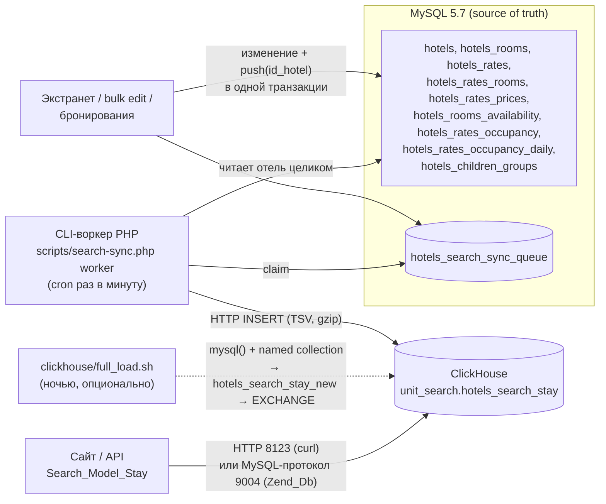

# Unit.Travel — поисковый слой на ClickHouse

Поисковый кэш для инвентори-системы отелей Unit.Travel (PHP 5 + ZF1 + MySQL 5.7).
MySQL остаётся источником истины; в ClickHouse лежат готовые данные для поиска, которые читаются без JOIN.

Кэш отвечает на два запроса:

1. **Выдача по направлению** — минимальная цена за проживание по 500–1000 отелям для дат заезда/выезда и состава гостей.
2. **Карточка отеля** — все доступные рум-рейты выбранного отеля на эти даты и состав гостей, с ценами по ночам.

Состав гостей — по номерам: взрослые + возраста детей, до 4 номеров в запросе. Цена номера — за число гостей (окно цен по числу гостей; нет настроек — одна цена за номер), дети — по детской политике отеля от цены номера и не дороже, чем взрослые (правило отель или категория номера может выключить). Вместимость — только существующие места; доп. кровати и детские кроватки — условия проживания, в расчёт не входят. Правила — раздел 5.

Всё в этой папке проверено на PHP 5.6.40 + Zend Framework 1.12.20 + MySQL 5.7.44 + ClickHouse 24.8 (результаты — в разделе «Проверка»).

---

## 1. Архитектура


```mermaid
flowchart LR
    subgraph MySQL["MySQL 5.7 (source of truth)"]
        T[hotels, hotels_rooms, hotels_rates,<br/>hotels_rates_rooms, hotels_rates_prices,<br/>hotels_rooms_availability, hotels_rates_occupancy,<br/>hotels_rates_occupancy_daily,<br/>hotels_children_groups]
        Q[(hotels_search_sync_queue)]
    end
    A[Экстранет / bulk edit /<br/>бронирования] -- "изменение + push(id_hotel)<br/>в одной транзакции" --> T
    A --> Q
    W["CLI-воркер PHP<br/>scripts/search-sync.php worker<br/>(cron раз в минуту)"] -- claim --> Q
    W -- "читает отель целиком" --> T
    W -- "HTTP INSERT (TSV, gzip)" --> CH[("ClickHouse<br/>unit_search.hotels_search_stay")]
    F["clickhouse/full_load.sh<br/>(ночью, опционально)"] -. "mysql() + named collection<br/>→ hotels_search_stay_new → EXCHANGE" .-> CH
    S["Сайт / API<br/>Search_Model_Stay"] -- "HTTP 8123 (curl)<br/>или MySQL-протокол 9004 (Zend_Db)" --> CH
```

**Главная идея — нарастающие суммы.** Одна строка `hotels_search_stay` = один рум-рейт на одну дату горизонта `[сегодня; сегодня + 365]`.
В строке хранится `c{g}(d)` — сумма цен номера за `g` гостей по продаваемым ночам *до* даты `d`, и `k(d)` — сколько таких ночей было до `d`. Тогда для проживания `[checkin; checkout)`:

* цена = `c{g}(checkout) − c{g}(checkin)`;
* все ночи продаются ⇔ `k(checkout) − k(checkin) = nights`;
* ночь, где на g гостей не продаётся (дневная цена 0), добавляет к `c{g}` 2^40 — разность `≥ 2^40` значит «на g гостей это проживание не продаётся».

Так же хранится число ночей, где свободно не меньше 2 / 3 / 4 номеров (`k2..k4`). Всё, что зависит от даты и тарифа (цены по числу гостей, дневные цены, наследование производного тарифа), считает сборщик; цену детей поиск считает из цены номера за проживание и детской политики отеля (статические колонки строки).

Поэтому поиск читает **2 строки на рум-рейт при любой длине проживания**, а ограничения (CTA, min/max LOS, min/max ADV) берутся из строки даты заезда, CTD — из строки даты выезда.

## 2. Что в папке

| Файл | Назначение |
|---|---|
| `mysql/00_recommended_indexes.sql` | Составные UNIQUE-индексы из анализа (ускоряют сборщик, защищают от дублей). Не обязательно, но рекомендуется |
| `mysql/01_hotels_search_sync_queue.sql` | Таблица очереди `hotels_search_sync_queue` |
| `mysql/01b_occupancy_children.sql` | Вместимость и дети: `hotels_rooms.max_infants`, `extra_beds`, `cots`, `cots_and_extra_beds`, `hotels_rates_rooms.base_occupancy`, `hotels_rates_occupancy.amount_type` (% или сумма), таблица `hotels_children_groups`; можно запускать повторно, обновляет и прошлую версию прототипа |
| `mysql/02_demo_data.sql` | Генератор демо-данных: 2000 отелей × 3–5 номеров × 3–4 тарифа × 365 дней (цены, наличие, цены по числу гостей % и суммой, дневные цены на гостей, детская политика с 5 типами цены, вместимость) |
| `mysql/03_demo_cleanup.sql` | Удаление демо-данных (строго по сохранённым диапазонам id) |
| `clickhouse/01_schema.sql` | База `unit_search`, таблица `hotels_search_stay` |
| `clickhouse/01b_upgrade_occupancy.sql` | `ALTER` для таблицы прошлых версий (без детей или с прошлой детской схемой); после него — полная пересборка кэша |
| `clickhouse/02_users.sql` | Пользователи `search_writer` (синхронизация) и `search_reader` (сайт) |
| `clickhouse/config.d/unit_mysql.xml` | Подключение ClickHouse → MySQL для полной загрузки без PHP |
| `clickhouse/03_full_load_from_mysql.sql`, `03b_build_chunk.sql`, `04_full_load_swap.sql`, `full_load.sh` | Полная пересборка силами ClickHouse (~1 мин на 2000 отелей вместе с OPTIMIZE) |
| `library/Search/ClickHouse/*` | Клиент ClickHouse: `Client` + транспорты `Transport_Http` (curl) и `Transport_Mysql` (Zend_Db, порт 9004) |
| `library/Search/Model/Stay.php` | Модель поиска: `search()`, `hotelRooms()` и `hotelRates()` |
| `library/Search/Occupancy.php` | Состав номера и цена (число гостей цены, дети, младенцы, «не дороже взрослых») и самая дешёвая комбинация нескольких номеров — для карточки отеля и перерасчёта брони |
| `library/Search/Sync/*` | Синхронизация: `Queue` (очередь в MySQL), `Builder` (MySQL → строки кэша), `Worker` |
| `scripts/search-sync.php` (+ `.config.php.dist`) | CLI синхронизации |
| `application/controllers/SearchController.php` | Пример ZF1-контроллера (JSON API) |
| `tests/*` | Проверки: эталон «в лоб», сквозной тест очереди, сравнение транспортов, бенчмарк, smoke-тест контроллера, `occupancy_unit.php` (цена номера с детьми против полного перебора, без базы); `inject_duplicates.sql` — дубли строк для проверки на стенде |

**Имена.** Все новые таблицы — с префиксом `hotels_` (`hotels_search_stay`, `hotels_search_sync_queue`, `hotels_children_groups`, `hotels_search_demo_registry`, staging `hotels_search_stg_*`), все поля-идентификаторы — `id_*`, как в ваших таблицах: `id_hotel`, `id_rate_room`, `id_room`, `id_rate`, `id_parent`, `id_country`, `id_region`, `id_city`, `id_currency`, `id_board_type`, `id_cancel_policy`, `id_room_type`, `id_access_group` (из `hotels_rates.access_group_id`). Так же названы ключи параметров поиска и ответов моделей.

Код совместим с PHP 5.4+ (только `array()`, без `??`, скалярных тайпхинтов и т.п.), классы названы по соглашению ZF1 (`Search_Model_Stay` → `library/Search/Model/Stay.php`) и подключаются автозагрузчиком `Zend_Loader_Autoloader::getInstance()->registerNamespace('Search_')`.

## 3. Развёртывание (сначала на стейдже)

```bash
# --- MySQL
mysql -u... -p... tezdynamix < mysql/01_hotels_search_sync_queue.sql
mysql -u... -p... tezdynamix < mysql/01b_occupancy_children.sql  # вместимость, «% или сумма», base_occupancy рум-рейта, детские группы
mysql -u... -p... tezdynamix < mysql/00_recommended_indexes.sql   # по желанию, см. комментарии в файле
mysql -u... -p... tezdynamix < mysql/02_demo_data.sql              # демо: ~2 мин, 7.2 млн цен, 2.3 млн наличия, детская политика

# --- ClickHouse
cp clickhouse/config.d/unit_mysql.xml /etc/clickhouse-server/config.d/    # вписать хост/логин MySQL (нужен только SELECT)
clickhouse-client --multiquery < clickhouse/01_schema.sql                 # таблица прошлой версии: 01b_upgrade_occupancy.sql
clickhouse-client --multiquery < clickhouse/02_users.sql                  # после config.d: там GRANT на named collection

# --- первичная загрузка кэша (любой из двух способов)
CH="clickhouse-client --user search_writer --password ..." clickhouse/full_load.sh   # силами ClickHouse, ~1,5 мин
php scripts/search-sync.php full                                                     # силами PHP-воркера, ~4 мин

# --- PHP
cp scripts/search-sync.config.php.dist scripts/search-sync.config.php   # MySQL, ClickHouse (search_writer), timezone
php scripts/search-sync.php stats
```

Cron (на одной машине — CLI держит `flock`, два воркера одновременно не запустятся):

```cron
* * * * *   php /var/www/unit/scripts/search-sync.php worker 55        # разбирать очередь
5 0 * * *   php /var/www/unit/scripts/search-sync.php enqueue-all nightly   # сдвиг горизонта на новый день + сверка
0 */2 * * * php /var/www/unit/scripts/search-sync.php optimize           # склеить версии строк (см. «Эксплуатация»)
```

Удалить демо: `mysql ... < mysql/03_demo_cleanup.sql` (3–8 мин, удаляет пачками), затем `php scripts/search-sync.php hotels <id_hotel_first>-<id_hotel_last>` (id печатает генератор) — удалённые отели получат tombstone-строки и пропадут из поиска.

## 4. Правила расчёта (что считается «доступно» и «сколько стоит»)

Одни и те же правила реализованы трижды — в `Search_Sync_Builder` (PHP), в `clickhouse/03b_build_chunk.sql` (SQL) и в эталоне `tests/reference.php`, и все три дают одинаковый результат.

* **В поиск попадает рум-рейт**, если активны отель, номер и тариф (`active = 1`) и есть связь в `hotels_rates_rooms`.
* **Базовая цена ночи** (цена в календаре, она за `base_occupancy` гостей):
  * самостоятельный тариф — строка `hotels_rates_prices` с `active = 1` и `price IS NOT NULL`, иначе ночь не продаётся;
  * производный тариф (`id_parent > 0`): своя строка с `active = 0` → не продаётся; своя `price` при `derive_type = 0` → своя цена («фиксированная сумма»);
    иначе цена родителя на том же номере × `(100 + dv) / 100`, где `dv` = своя `derive_value` при `derive_type = 4`, иначе `−hotels_rates.derive_value` (изменение производного тарифа — только в процентах).
* **Наличие:** строка `hotels_rooms_availability`, иначе `allotment` номера, `net_booked = 0`, `active = 1`; продаётся, если `active = 1` и `allotment − net_booked > 0`.
* **Цена номера за g гостей** (дети считаются отдельно, раздел 5); `hotels_rooms.pricing_model` не используется:
  * дневная цена `hotels_rates_occupancy_daily(rate_room, g, дата)` с `price > 0` — цена этой ночи (действует, только если ночь продаётся и g не выключено); `price = 0` — **на g гостей в эту ночь не продаётся**, значит и всё проживание с этой ночью на g гостей не продаётся (на другое число гостей — продаётся);
  * иначе строка окна `hotels_rates_occupancy(rate_room, g)`: `amount_type = 0` → база × (1 + amount/100), `1` → база + amount (не меньше 0); `active = 0` → на g гостей не продаётся; нет строки → база (одна цена для любого числа гостей);
  * производный тариф: своя дневная цена > своя строка окна (от своей базы) > как у родителя — цена родителя за g (его дневная цена или его строка окна от его базы) × `(100 + dv) / 100`; в ночь со своей ценой — строка окна родителя к своей цене. Дневная цена 0 у родителя закрывает g и у производного, если у него нет своей дневной цены или своей строки окна на это g.
* **На сколько гостей продаётся** (`gmask`): g ≤ `max_adults` (0 → max(`max_occupancy`, `base_occupancy`)), g ≤ `max_occupancy`, g ≤ 8 и g не выключено (своя строка окна, у производного без своей строки — строка родителя).
* **Дубли строк** (в MySQL нет UNIQUE-ключей, дубли создаёт, например, ошибка пагинации bulk edit): для цены, наличия, надбавки и дневной цены берётся строка с **максимальным id**, целиком. Лучше закрыть дубли ключами из `mysql/00_recommended_indexes.sql`.
* **Ограничения** даты берутся из своей строки цены рум-рейта, иначе из тарифа: `min_los`/`min_adv` (NULL → значение тарифа), `max_los`/`max_adv` (0 или NULL → без ограничения), `cta`/`ctd`. Проверяются по дате заезда (CTA, LOS, ADV) и дате выезда (CTD).
* **Округление** целочисленное half up в копейках — PHP и ClickHouse дают одинаковые суммы до копейки.
* Все цены — в валюте отеля (`id_currency`); поиск сортирует по цене внутри одной валюты.

**Нужно подтвердить с бизнесом** (реализовано так, как показано выше, меняется в одном месте каждой реализации):
1. Производный тариф наследует у родителя цену и цены по числу гостей, но не ограничения (CTA/CTD/LOS) — ограничения только свои или тарифа. Детская политика одна на отель.
2. `min_los` проверяется по дню заезда (как у Booking.com «arrival-based»). Если нужна проверка по каждой ночи — нарастающие суммы это не покрывают, нужна отдельная доработка.
3. Нет строки окна на g гостей → базовая цена; строка с `active = 0` → на g гостей не продаётся.
4. Вместимость, дети и цены по числу гостей — по решениям из раздела 5 (подтверждены).
5. Разные валюты: для сортировки выдачи по цене между странами нужен курс (удобно словарём ClickHouse `dictGet`).
6. `hotels_rates_occupancy_daily`: дневная цена — абсолютная цена ночи на g гостей и заменяет строку окна, `price = 0` — на g гостей в эту ночь не продаётся (решение подтверждено); производный тариф наследует дневные цены родителя (× изменение тарифа), если у него нет своей строки на это g; ночь, закрытая по базовой цене, дневной ценой не открывается. Если таблица на самом деле хранит что-то другое (например, заранее посчитанные цены по всем датам или процент, как было в старой колонке `amount`), правило меняется в `Search_Sync_Builder`, `03b_build_chunk.sql` и `tests/reference.php`.

## 5. Вместимость, дети и несколько номеров

### Правила (решения бизнеса)

1. **Вместимость — только существующие спальные места**, как у Booking.com: `max_occupancy`, `max_adults`, `max_children` и новый `max_infants`. Доп. кровати и детские кроватки (`extra_beds`, `cots`, «и / или» — `cots_and_extra_beds`) вместимость **не увеличивают** и в цену **не входят**: это условия проживания (их цены выводятся примечанием, без настройки — по запросу с подтверждением отеля). Карточка отеля отдаёт эти три поля для условий.
2. **Цена номера — за число гостей** из окна «цены для другого числа гостей» (`hotels_rates_occupancy`): к цене в календаре (она за `base_occupancy` гостей) — процент или сумма за ночь (`amount_type`), «выключено» (`active = 0`) — на столько гостей не продаётся; дневная цена `hotels_rates_occupancy_daily` важнее строки окна, дневная цена 0 — на столько гостей в эту ночь не продаётся. Нет строк — **одна цена за номер для любого числа взрослых** в пределах `max_adults` (бывший per room). Доплата за взрослого сверх `base_occupancy` (бывшая `extra_bed_adult_price`) в поиск не входит — она в условиях проживания. `hotels_rooms.pricing_model` поиском не используется: модель следует из того, настроены ли цены по числу гостей.
3. **Базовое размещение рум-рейта** — `hotels_rates_rooms.base_occupancy`, NULL — как у номера; у производного тарифа — как у родителя (только чтение). Это смысл цены в календаре; в расчёт поиска напрямую не входит (строки окна заданы относительно неё).
4. **Производный тариф наследует цены по числу гостей родителя**: своя дневная цена > своя строка окна (процент или сумма к цене производного тарифа, как в окне родителя) > цена родителя за это число гостей × (100 + %) / 100. Выключенное у родителя число гостей выключено и у производного, если у него нет своей строки. Своя цена ночи в календаре (`derive_type = 0` — «фиксированная сумма») — база производного, к ней применяется строка окна родителя, дневные цены родителя в эту ночь не действуют.
5. **Детская политика — одна на отель** (`hotels_children_groups`, экран «Children's prices by age»): до 4 возрастных групп на 0–17 лет, у группы одна цена за ребёнка за ночь: бесплатно / фикс / % тарифа на номер / % цены взрослого (цена номера / число гостей × %) / полная цена взрослого. Возраст вне групп — взрослый (и для цены, и для вместимости). Отель не принимает детей (`allow_children = 0`) или ребёнок младше `children_min_age` — номер не подходит. Группы по тарифам и календарные исключения цен — следующий этап.
6. **Младенец** — 0–2 года (0–2,99; `Search_Occupancy::INFANT_AGE_MAX`) в детской группе: младенцев не больше `max_infants`; при `is_without_infants = 1` младенец не считается в `max_children` / `max_occupancy` и не занимает место; платит по своей группе (обычно бесплатно).
7. **За сколько гостей цена номера**: за число взрослых; если на столько рум-рейт не продаётся (например, «1 guest» выключен), — за ближайшее большее продаваемое число, а свободные места бесплатно занимают самые дорогие дети. Детей не хватает — номер не подходит.
8. **Не дороже, чем взрослым**: итог номера не больше цены номера за (гостей + платящих детей), если на столько продаётся. В номере с одной ценой для любого числа гостей ребёнок поэтому бесплатен, пока взрослые + дети укладываются в `max_adults`; вернуть контроль отелю — строка окна «3 гостя: + сумма» или реальный `max_adults`.
   **Правило можно выключить**: `hotels.children_as_adults = 0` — для всего отеля, `hotels_rooms.children_as_adults` — для категории номера (NULL — как у отеля, 0 / 1 — своё). Выключено — дети всегда платят по детской политике, даже если цена за столько же взрослых ниже. Свободные места цены номера (пункт 7) дети занимают бесплатно и при выключенном правиле: это не цена взрослого, а места, уже оплаченные в цене номера.
9. **Несколько номеров** в одном запросе (до 4, например «2 + ребёнок 5 лет» и «2»): каждый номер считается отдельно, цена отеля — самая дешёвая комбинация с учётом того, сколько номеров каждого типа свободно (наличие у типа номера общее для всех его тарифов).

Детская цена считается от цены номера **за всё проживание**, округление half up один раз (а не по ночам).

### Данные в MySQL (`mysql/01b_occupancy_children.sql`)

| Где | Поле / таблица | Смысл |
|---|---|---|
| `hotels_rooms` | `max_occupancy`, `max_adults`, `max_children`, `is_without_infants` | уже есть; вместимость — только существующие места |
| `hotels_rooms` | `max_infants` | младенцев 0–2 года максимум: NULL — без лимита, 0 — не принимаются |
| `hotels_rooms` | `extra_beds`, `cots`, `cots_and_extra_beds` | доп. кроватей / кроваток можно поставить, «и» (1) / «или» (0) — только условия проживания |
| `hotels_rates_rooms` | `base_occupancy` | базовое размещение рум-рейта, NULL — как у номера |
| `hotels_rates_occupancy` | `amount_type` | 0 — `amount` в процентах, 1 — сумма за ночь в валюте отеля (может быть < 0) |
| `hotels_children_groups` | `id_hotel`, `age_from`, `age_to`, `price_type`, `price_value`, `active` | возрастные группы отеля; `price_type`: 1 бесплатно, 2 фикс за ночь, 3 % тарифа на номер, 4 % цены взрослого, 5 полная цена взрослого |
| `hotels` | `allow_children`, `children_min_age` | уже есть |
| `hotels` | `children_as_adults` | 1 (по умолчанию) — «не дороже, чем взрослым» включено, 0 — дети всегда по детской политике |
| `hotels_rooms` | `children_as_adults` | NULL — как у отеля, 0 / 1 — своё значение для категории номера |

Скрипт можно запускать повторно; он же убирает объекты прошлой версии прототипа (`places_regular`, `share_slots`, `hotels.extra_bed_adult_price`, `hotels_children_prices`, группы тарифов). Переход с `pricing_model` — запросы проверки в конце скрипта: строки окна у номеров «per room» раньше не действовали, теперь действуют.

### Расчёт одного номера

```
a  = взрослые + дети, чей возраст не попал ни в одну группу;  a <= 8
дети с местом: все из групп, кроме младенцев при is_without_infants
лимиты: детей с местом <= max_children,  a + они <= max_occupancy,  младенцев <= max_infants
g  = a, если рум-рейт продаётся на a гостей во все ночи проживания; иначе ближайшее продаваемое g из (a; a + детей с местом]; нет — не подходит
P  = цена номера за g гостей за проживание (разность нарастающих сумм c{g})
ребёнок: 1 → 0,  2 → фикс × ночей,  3 → P × %,  4 → P / g × %,  5 → P / g       (half up)
(g − a) самых дорогих детей с местом — бесплатно (заняли места, которые уже в цене номера)
итог = P + цены детей;  если children_as_adults = 1 и на g + платящих продаётся: итог = min(итог, цена номера за g + платящих)
```

Примеры (`tests/occupancy_unit.php` проверяет первые два):

* Номер с одной ценой 1 400 грн за ночь, группа 12–17 — 50 % цены взрослого, 2 взрослых + 12 лет. `max_adults = 3`: 1 400 / 2 × 50 % = 350, но как три взрослых — 1 400, итог **1 400**. `max_adults = 2`: итог **1 750**.
* «1 guest» выключен, 2 гостя — 100 €, 3 гостя — 115 €, 1 взрослый + дети 7 и 9 лет (50 % цены взрослого): цена за 2 гостей, один ребёнок на втором месте бесплатно, второй 100 / 2 × 50 % = 25 €, 125 € → как три взрослых **115 €**.
* То же с выключенным правилом (`children_as_adults = 0`): **125 €**; номер с одной ценой 1 400 грн, `max_adults = 3`, 2 взрослых + 12 лет: **1 750** вместо 1 400.
* Производный тариф −10 %: родитель 94 € за 2 гостей, 108,10 € за 3 (+15 %) → 84,60 € и 97,29 €. Своя строка производного «3 гостя: +20 €» → 104,60 €.

Правило реализовано трижды и сверяется тестами: `Search_Occupancy::price()` (карточка отеля, перерасчёт брони), SQL в `Search_Model_Stay::_roomPricesSql()` (выдача) и эталон `tests/reference.php` (полный перебор детей на свободные места по данным MySQL).

### Кэш ClickHouse

Колонки `hotels_search_stay` (`clickhouse/01_schema.sql`, для существующей таблицы — `01b_upgrade_occupancy.sql`):

* статические: `base_occupancy`, `max_children`, `max_occupancy`, `max_infants` (255 = без лимита), `infants_excluded`, `children_min_age` (255 = отель не принимает детей), `age_group Array(UInt8)` — 18 элементов, возраст 0..17 → номер группы (0 = взрослый), `child_type` / `child_value` — тип цены группы и значение (фикс — копейки за ночь, процент — базисные пункты), `children_as_adults` — правило «не дороже, чем взрослым» (значение номера, NULL → отеля), `extra_beds`, `cots`, `cots_and_extra_beds` — для условий проживания;
* нарастающие: `c1..c8` — цена номера за g гостей (ночь, закрытая на g гостей дневной ценой 0, добавляет 2^40 = `Search_Occupancy::CLOSED`), `k`, `k2..k4` — ночей, где свободно не меньше 1 / 2 / 3 / 4 номеров. Детских нарастающих сумм больше нет: цену ребёнка поиск считает из цены номера за проживание;
* `gmask` — на сколько гостей продаётся (в нём `max_adults`, `max_occupancy`, выключенные строки окна), `max_guests` — максимум.

Объём: 10,25 млн строк = **312 МиБ** на диске (1,64 ГиБ без сжатия). В прошлой версии с детскими нарастающими суммами было 455 МБ, до поддержки детей — 272 МБ.

### Поиск

```php
// один номер: 2 взрослых + дети 7 и 4 лет
Search_Model_Stay::getInstance()->search(array('checkin' => '2026-12-10', 'nights' => 7, 'id_region' => 243836,
    'adults' => 2, 'children' => array(7, 4)));
// несколько номеров
Search_Model_Stay::getInstance()->search(array('checkin' => '2026-12-10', 'nights' => 7, 'id_region' => 243836,
    'rooms' => array(array('adults' => 2, 'children' => array(5)), array('adults' => 2))));
// 'guests' => 2 работает как раньше: 2 взрослых без детей
```

* **Один номер** — всё в ClickHouse: разности нарастающих сумм по двум строкам рум-рейта, затем дети запроса разворачиваются в строки (`ARRAY JOIN` списка детей) и по каждому рум-рейту считаются состав, число гостей цены, цены детей и итог, затем минимум по отелю, сортировка и страница. SQL одинакового размера при любом числе детей.
* **Почему SQL такой**: ClickHouse при разборе запроса раскрывает алиасы, и цепочка «итог → цены детей → цена номера → число гостей» разбиралась 0,5 с. Поэтому промежуточные значения передаются параметрами вложенных лямбд (`arrayMap((gd, ...) -> ..., [значение], ...)[1]` — аналог `let`), разбор занимает ~50 мс.
* **Несколько номеров** — ClickHouse отдаёт по каждому отелю лучший рум-рейт каждого типа номера для каждого номера запроса и сколько номеров этого типа свободно на все ночи (до 4, по `k2..k4`); PHP (`Search_Occupancy::cheapestCombination()`) выбирает самую дешёвую комбинацию, затем фильтр цены, сортировку и страницу.
* Ответ `search()`: у каждого отеля `price` / `price_minor` — за все номера, `rooms` — выбранный рум-рейт и цена каждого номера; для одного номера поля рум-рейта продублированы в самом элементе, как раньше.
* **Карточка отеля** — `hotelRooms($idHotel, $criteria)`: для каждого номера запроса все доступные рум-рейты с разбивкой (`price_adults` — цена номера, `price_children`, `adults` с учётом детей-«взрослых», `guests` — за сколько гостей взята цена номера, `capped` — дети посчитаны как взрослые, по каждому ребёнку группа, место `bed` / `free` (бесплатно на месте, которое уже в цене) / `none` (младенец без места) / `adult` (возраст вне групп), цена и `as_adult`, цены номера по ночам, условия `extra_beds` / `cots` / `cots_and_extra_beds`, `base_occupancy`) и `best` — самая дешёвая комбинация. `hotelRates()` — то же для одного номера (список, как раньше).
* Фильтр `price_min` / `price_max` — по цене отеля (за все номера, после выбора лучшего варианта).

### Скорость

Замеры `tests/bench_search.php` (Docker, 4 общих vCPU, PHP 5.6, регион ~1000 отелей, 7 ночей, 30 запросов на разные даты, полное время вызова метода из PHP, p50 / p95, данные после `OPTIMIZE`). Колонка «прошлая версия» — замер прошлой версии прототипа (места и доп. кровати) из прошлого README, на этом же стенде, но в другой день: стенд общий, разброс между днями 10–30 %.

| Запрос | прошлая версия, HTTP | эта версия, HTTP 8123 | эта версия, MySQL 9004 |
|---|---|---|---|
| `search()` регион, 2 взрослых | 31 / 36 мс | 32 / 43 мс | 29 / 32 мс |
| `search()` 1000 `id_hotel`, 2 взрослых | 35 / 45 мс | 35 / 40 мс | 37 / 45 мс |
| `search()` 14 ночей, 3 взрослых, 4–5*, BB/HB, возвратные | 27 / 34 мс | 28 / 32 мс | 25 / 30 мс |
| `search()` все результаты (limit 1000) | 40 / 46 мс | 45 / 51 мс | 49 / 57 мс |
| `search()` 2 взрослых + дети 7 и 4 лет | 104 / 120 мс | 144 / 176 мс | 143 / 176 мс |
| `search()` 2 номера: 2 + ребёнок 5 лет, 2 | 169 / 184 мс | 203 / 247 мс | 216 / 242 мс |
| `search()` 3 номера: 2 + 1 год, 2 + 9 лет, 1 | 192 / 211 мс | 247 / 281 мс | 240 / 270 мс |
| `hotelRates()` один отель, 2 взрослых | 23 / 30 мс | 29 / 35 мс | 26 / 32 мс |
| `hotelRooms()` один отель, 2 номера с детьми | 30 / 35 мс | 30 / 43 мс | 30 / 34 мс |
| `search()` с детьми повторно, `setQueryCacheTtl(60)` | 4–10 мс | 6–9 мс | 5–9 мс |

Где время у поиска с детьми (запрос без PHP ~130–150 мс): ~70 мс ClickHouse тратит на разбор SQL (у запроса только взрослых ~5–7 мс), ~65 мс — на чтение и группировку двух строк каждого рум-рейта с детскими массивами и развёрнутыми строками детей. Разбор дороже прошлой версии, потому что цена ребёнка теперь зависит от числа гостей, за которое взята цена номера, и считается в запросе: в первом варианте с цепочкой алиасов разбор занимал 0,5 с, со связыванием через параметры лямбд — ~50 мс на уровень детей. Что пробовали и не взяли: итог в одном уровне с группировкой рум-рейта (разбор 240 мс), отдельный уровень подзапроса (+50 мс), ClickHouse 25.8 (в 2 раза медленнее на этом запросе). Что даёт выигрыш на проде:

* выделенный сервер ClickHouse (здесь 4 общих vCPU): время почти линейно зависит от частоты ядра;
* кэш результатов ClickHouse для выдачи: `Search_Model_Stay::getInstance()->setQueryCacheTtl(60)` добавляет к запросу `SETTINGS use_query_cache = 1, query_cache_ttl = 60` — одинаковый запрос в течение минуты отдаётся за 5–9 мс (проверено через HTTP и 9004 с детьми, ответы совпадают); цены в выдаче могут отставать на эти секунды, бронирование всё равно перепроверяется в MySQL;
* запрос только взрослых (самый частый) по скорости как прежний: для него строится прежний по форме SQL.

### Что сделать разработчикам

1. Применить `mysql/01b_occupancy_children.sql`; перенести детскую политику отеля в `hotels_children_groups` (5 типов цены), заполнить `max_infants`, `extra_beds`, `cots`, «и / или»; проверить вместимость номеров — только существующие места (доп. кровати убрать из `max_occupancy` / `max_adults`).
2. Переход с `pricing_model`: убрать или выключить строки окна по числу гостей у номеров «per room», если они остались от старых настроек (запросы в конце `01b`); доплату за доп. взрослого из цены перенести в условия проживания или в строку окна «N гостей: + сумма».
3. Экстранет: окно по числу гостей — «% или сумма», у производного рум-рейта `base_occupancy` только для чтения, пустая строка = «как у родителя»; проверки — группы без пропусков от 0 (иначе младенец без группы считается взрослым), `max_children <= max_occupancy`, `max_infants <= max_children` при учёте младенцев; превью цены с детьми (правило «не дороже взрослых» в номере с одной ценой делает ребёнка бесплатным); переключатель «Считать детей по цене взрослых, если так дешевле» в настройках отеля (детская политика) и в номере («как у отеля / да / нет»).
4. Очередь: `Search_Sync_Queue::push()` при изменении детских групп, `allow_children` / `children_min_age` / `children_as_adults`, вместимости номера, `base_occupancy` рум-рейта, окна по числу гостей (раздел 6).
5. Выдача и карточка — `search()` с `rooms` / `adults` + `children`, `hotelRooms()`; пример API — `SearchController`.
6. Перерасчёт брони по MySQL — те же правила; готовая независимая реализация «в лоб» по MySQL — `tests/reference.php` (`referenceRooms()`), её можно взять за основу.

## 6. Синхронизация MySQL → ClickHouse через HTTP (текущий этап)

### Как устроено

1. **Очередь** `hotels_search_sync_queue` — одна строка на «грязный» отель. `Search_Sync_Queue::push($hotelId, 'reason')` идемпотентен: повторный вызов только увеличивает `version`.
2. **Воркер** (`Search_Sync_Worker::run()`, запускается `scripts/search-sync.php worker`) атомарно забирает пачку отелей (`UPDATE ... SET claimed_by = token ... LIMIT n`), пересобирает их **целиком** и удаляет из очереди только если `version` не изменилась за время сборки — изменение, пришедшее во время сборки, не теряется. Упавший воркер: через 10 минут отели заберёт следующий.
3. **Сборщик** (`Search_Sync_Builder::build()`) читает отели пачками по 10 (7 запросов на пачку, без JOIN по истории), считает строки по правилам из разделов 4 и 5 и отдаёт их готовыми TSV-строками — память PHP не растёт.
4. **Вставка**: `Search_ClickHouse_Client::insertTsv()` → `POST /?query=INSERT ... FORMAT TabSeparated`, тело сжато gzip, ~250 тыс. строк (≈50 отелей) на одну вставку. Одна вставка = один атомарный блок, поэтому отель никогда не виден наполовину.
5. **Версии**: все строки отеля в одной сборке получают один `ver`; `ReplacingMergeTree(ver, is_deleted)` оставляет последнюю версию, `SELECT ... FINAL` видит только её. Поиск дополнительно требует `min(ver) = max(ver)` для строк заезда и выезда.
6. **Удаления**: рум-рейты, которые были в ClickHouse, но больше не собираются (выключен тариф/номер/отель, удалена связь), получают tombstone-строки `is_deleted = 1`.

### Где ставить отель в очередь (задача для разработчиков)

`Search_Sync_Queue::getInstance()->push($hotelId, 'reason')` — желательно в той же транзакции MySQL, что и само изменение:

| Место в коде | Когда |
|---|---|
| `Hotels_Calendar_Bulkedit::doAction()` | после применения задачи bulk edit (цены, ограничения, наличие) |
| `Hotels_Calendar_Bulkedit_Grid::doCreate()` | не нужно: в кэш попадает только применённое воркером bulk edit |
| `Hotels_Rates_Grid::doSaveRate()`, удаление тарифа в `HotelsController::editrateAction()` | тариф: цена-родитель, скидка, каналы, видимость, привязка к номерам, min_los/min_adv |
| `Hotels_Rooms_Grid::save()`, удаление номера в `HotelsController::editroomAction()` | номер: allotment, вместимость (`base_occupancy`, `max_*`, `max_infants`, `is_without_infants`), доп. кровати и кроватки (`extra_beds`, `cots`, `cots_and_extra_beds`), `children_as_adults`, активность |
| Экран «Children's prices by age», всё, что пишет `hotels_children_groups` | детская политика отеля: группы и их цены |
| `Hotels_Rates_Occupancy::doUpdate()` | окно цен по числу гостей (% или сумма, выключено), `base_occupancy` номера и рум-рейта (`hotels_rates_rooms.base_occupancy`) |
| Всё, что пишет `hotels_rates_occupancy_daily` | дневные цены на число гостей (окно occupancy в календаре, bulk edit, API/channel manager) |
| `Hotels_Grid::save()` | отель: звёзды, регион, валюта, активность, `allow_children`, `children_min_age`, `children_as_adults` |
| Создание/отмена бронирования | изменение `net_booked` в `hotels_rooms_availability` |
| cron `enqueue-all` раз в сутки | сдвиг горизонта на новый день, сверка |

### Производительность синхронизации (PHP 5.6)

| Операция | Время |
|---|---|
| 1 отель (≈4 400 строк) | 107–113 мс (прошлая версия — 120–150 мс на ≈5 900 строк) |
| 50 отелей (≈256 тыс. строк) | 5,0–5,1 с (прошлая версия — 5,4 с) |
| Все 2002 отеля (10,25 млн строк), PHP-воркер | 4 мин 39 с (прошлая версия — 4 мин 05 с; в этот раз параллельно шли тесты) |
| Все 2002 отеля, силами ClickHouse (`full_load.sh`: staging 17 с + сборка 79 с, без `OPTIMIZE`) | ~1,6 мин (прошлая версия — ~1,5 мин) |

## 7. Прямая связь MySQL ↔ ClickHouse без HTTP

**Чтение сайтом через MySQL-протокол ClickHouse (порт 9004)** — то, что по ссылке из документации. ClickHouse принимает подключения как MySQL-сервер, поэтому работает штатный `Zend_Db_Adapter_Pdo_Mysql`:

```php
Search_ClickHouse_Client::setDefault(Search_ClickHouse_Client::factory(array(
    'transport' => 'mysql', 'host' => 'clickhouse.internal', 'port' => 9004,
    'username' => 'search_reader', 'password' => '...', 'dbname' => 'unit_search',
)));
// или сырой Zend_Db:
$ch = Zend_Db::factory('Pdo_Mysql', array('host' => 'clickhouse.internal', 'port' => 9004, 'username' => 'search_reader',
    'password' => '...', 'dbname' => 'unit_search', 'charset' => 'utf8'));
$ch->fetchAll('SELECT id_hotel, count() FROM hotels_search_stay WHERE d = ? GROUP BY id_hotel', array('2026-12-10'));
```

Проверено: `fetchAll/fetchCol/fetchOne`, bind-параметры (PDO эмулирует prepared statements), `quoteInto` с массивами; ответы моделей через 9004 и через HTTP совпадают полностью, скорость одинаковая. Пользователь должен быть создан с `double_sha1_password` (см. `02_users.sql`). Ограничение: нет `INSERT ... FORMAT`, поэтому массовую запись воркера лучше оставить на HTTP.

**ClickHouse сам читает MySQL** (используется в `full_load.sh`):

* табличная функция `mysql(unit_mysql, table = 'hotels')` с named collection из `config.d/unit_mysql.xml` — пароль не хранится в SQL; нужны `SET mysql_datatypes_support_level = 'decimal'` (иначе DECIMAL придёт строкой) и права `MYSQL`, `NAMED COLLECTION`;
* тот же доступ можно оформить таблицей `ENGINE = MySQL(...)` или словарём с источником MySQL (`SOURCE(MYSQL(...)) LIFETIME(300)`) — удобно для справочников (валюты, курсы, типы питания);
* инкрементально так тоже можно (ClickHouse читает `hotels_search_sync_queue` и пересобирает отели SQL-ом), но логика очереди проще и прозрачнее в PHP — рекомендуем: инкрементально PHP-воркер, ночью или при сбоях — `full_load.sh`.

**Потоковая репликация (на будущее):** `MaterializedMySQL` в ClickHouse экспериментальный — для продакшена не рекомендуем. Если понадобится CDC — Debezium/Maxwell (binlog) → Kafka → ClickHouse (Kafka engine) или Altinity Sink Connector; но пересчёт нарастающих сумм всё равно нужен на уровне отеля, поэтому очередь «грязных» отелей остаётся.

## 8. Использование в PHP (ZF1)

Bootstrap (один раз):

```php
protected function _initClickHouse() {
    $config = new Zend_Config_Ini(APPLICATION_PATH . '/configs/application.ini', APPLICATION_ENV);
    Search_ClickHouse_Client::setDefault(Search_ClickHouse_Client::factory($config->clickhouse));
}
```

```ini
clickhouse.transport = "http"            ; или "mysql" (порт 9004)
clickhouse.host      = "clickhouse.internal"
clickhouse.port      = 8123
clickhouse.username  = "search_reader"
clickhouse.password  = "..."
clickhouse.dbname    = "unit_search"
clickhouse.timeout   = 3
clickhouse.settings.max_execution_time = 3
```

Поиск:

```php
$result = Search_Model_Stay::getInstance()->search(array(
    'checkin'   => '2026-12-10', 'nights' => 7,     // или 'checkout' => '2026-12-17'
    'adults'    => 2, 'children' => array(7, 4),    // один номер; или 'guests' => 2 — взрослые без детей, как раньше;
                                                    // или 'rooms' => array(array('adults' => 2, 'children' => array(5)), array('adults' => 2))
    'id_region' => 243836,                          // или 'id_hotel' => array(...), 'id_country', 'id_city' (число или массив)
    'stars'     => array(4, 5), 'id_board_type' => array(4, 7), 'refundable' => 1,   // необязательно
    'price_min' => 5000, 'price_max' => 20000,      // за всё проживание всех номеров, в валюте отеля
    'order'     => 'price', 'limit' => 30, 'offset' => 0,
));
// array('total' => 825, 'items' => array(array('id_hotel' => 1273, 'price' => 10603.89, 'price_minor' => 1060389,
//        'id_currency' => 46688, 'stars' => 3, 'nights' => 7,
//        'rooms' => array(array('adults' => 2, 'children' => array(7, 4), 'price' => 10603.89, 'price_minor' => 1060389,
//            'id_rate_room' => 6390, 'id_room' => .., 'id_rate' => .., 'id_board_type' => .., 'id_cancel_policy' => .., 'refundable' => ..)),
//        'id_rate_room' => 6390, ...   // для одного номера поля номера продублированы, как раньше
//      ), ...))

// карточка отеля: по каждому номеру запроса все рум-рейты с разбивкой и самая дешёвая комбинация
$offer = Search_Model_Stay::getInstance()->hotelRooms(1176, array('checkin' => '2026-12-15', 'nights' => 7,
    'rooms' => array(array('adults' => 2, 'children' => array(7, 4)), array('adults' => 2))));
// array('rooms' => array(0 => array('adults' => 2, 'children' => array(7, 4), 'items' => array(
//            array('id_rate_room' => 4462, 'id_room' => 1869, 'id_parent' => 1746, 'base_occupancy' => 2, 'rooms_left' => 6,
//                  'price' => 15727.97, 'price_adults' => 15727.97, 'price_children' => 0,
//                  'adults' => 2, 'guests' => 3, 'capped' => true,        // 7-летний платный -> дешевле как третий гость
//                  'children' => array(array('age' => 7, 'group' => 2, 'place' => 'bed', 'price' => 0, 'as_adult' => true),
//                                      array('age' => 4, 'group' => 1, 'place' => 'bed', 'price' => 0, 'as_adult' => false)),
//                  'nightly' => array(2154.41, 2154.41, ...),           // цена номера за 3 гостей по ночам
//                  'extra_beds' => 1, 'cots' => 2, 'cots_and_extra_beds' => 1, ...), ...)),   // условия проживания
//        1 => array(...)),
//       'best' => array('price' => 24138.97, 'price_minor' => 2413897, 'items' => array(0 => рум-рейт, 1 => рум-рейт)))

$rates = Search_Model_Stay::getInstance()->hotelRates(1672, array('checkin' => '2026-12-10', 'nights' => 7, 'guests' => 2));
// один номер: список рум-рейтов (как hotelRooms()['rooms'][0]['items']), поля прежние + разбивка

Search_Model_Stay::getInstance()->setQueryCacheTtl(60);   // необязательно: кэш результатов выдачи в ClickHouse на 60 с
```

Параметры JSON API (`SearchController`): `adults=2&children=7,4` для одного номера, `rooms=[{"adults":2,"children":[7]},{"adults":2}]` (JSON) или `rooms[0][adults]=2&rooms[0][children]=7,4&rooms[1][adults]=2`, `guests=2` — как раньше. Ограничения: до 4 номеров, до 8 взрослых и до 6 детей 0–17 лет в номере (400 при нарушении).

Прямые запросы к ClickHouse из своих моделей:

```php
// календарь доступности отеля: сколько рум-рейтов продаётся в каждую ночь и сколько номеров свободно
class Search_Model_HotelAvailability extends Search_Model_Abstract {
    public function byDay($hotelId, $from, $to) {
        return $this->_client->fetchAll('SELECT s.d AS d, countIf(s.avail > 0) AS sellable_rate_rooms,
                max(s.avail) AS max_rooms_left
            FROM hotels_search_stay AS s FINAL
            WHERE s.d IN (' . $this->_dateList($from, $to) . ') AND s.id_hotel = ' . $this->_int($hotelId) . '
            GROUP BY s.d ORDER BY s.d');
    }
}
```

Цена одной ночи — это разность нарастающих сумм соседних дат (`c{g}(d + 1) − c{g}(d)`), поэтому для цен используйте
`search()`/`hotelRooms()`/`hotelRates()` или ту же разность, а не сами колонки `c1..c8`.

Правила для своих запросов: всегда `FINAL`; фильтр по `d` первым (ключ сортировки `(d, id_hotel, id_rate_room)`), для диапазона дат одного отеля — явный список `d IN (...)`; в `WHERE` квалифицировать колонки алиасом таблицы, если в `SELECT` есть алиасы с теми же именами; в SQL подставлять только `_int()`, `_intList()`, `_date()`, `_dateList()`. Перед бронированием цену и наличие **обязательно** перепроверять в MySQL: кэш отстаёт на секунды.

Пример JSON API — `application/controllers/SearchController.php` (`/search/hotels?id_region=…`, `/search/hotel?id_hotel=…`): 400 на неверные параметры, 503 без подробностей, если ClickHouse недоступен.

## 9. Проверка (что и как проверено)

Окружение: Docker, 4 ядра; PHP 5.6.40 + ZF 1.12.20, MySQL 5.7.44 (ваш дамп + демо: 2000 отелей, 4 680 детских групп всех 5 типов цены, из них 80 неактивных; 9 721 строка окна по числу гостей, из них 1 497 суммой и 1 108 «выключено»; 200 рум-рейтов со своим `base_occupancy`; 400 отелей с выключенным «не дороже, чем взрослым», у 590 номеров своё значение), ClickHouse 24.8.

| Проверка | Результат |
|---|---|
| `tests/verify_reference.php` — эталон «в лоб» по ночам из MySQL (дети на свободные места и комбинации номеров — полным перебором) против `hotelRates()` / `hotelRooms()` / `search()` | финальная версия, 2 прогона по 200 случаев (seed 1 и 2): 2 022 цены рум-рейтов только для взрослых (с разбивкой по ночам), 1 948 цен с детьми (735 с платными детьми, из них 11 — цена за большее число гостей, чем взрослых, 497 — дети посчитаны как взрослые), 361 минимум по отелям с детьми, 227 цен отелей для 2–4 номеров (193 — с одним типом номера дважды) и 45 карточек с лучшей комбинацией, 136 минимумов с фильтрами и сортировкой, 388 проживаний с ночью, закрытой дневной ценой 0 (2 482 цены рум-рейтов и минимумы `search()`), 3 231 ночь с дневной ценой на число гостей, из них 482 закрытых; 666 расчётов, где `children_as_adults = 0` оставил детей по детской политике, хотя как взрослые было бы дешевле — **0 расхождений**; отели вашего дампа (id 1–4) — 0 расхождений |
| `tests/occupancy_unit.php` — `Search_Occupancy` без базы | 150 000 случайных номеров и составов (3 seed, в т.ч. закрытые дневной ценой 0 ночи): цена == полный перебор подмножеств детей на свободные места, «не дороже взрослых» и его выключение (`children_as_adults = 0`, 727 составов стали дороже), лимиты, 5 типов цены (своя формула округления); 37 500 запросов на 1–4 номера: комбинация == полный перебор с учётом наличия; примеры из раздела 5; разбор параметров — **ALL OK** |
| `tests/compare_php_vs_sql_build.sql` — PHP-сборщик против SQL-сборки ClickHouse | 10 253 124 строки, все колонки (цены за 1–8 гостей с наследованием производных тарифов и закрытыми ночами, детская политика, вместимость, `k2..k4`) — **идентичны** (EXCEPT DISTINCT в обе стороны + хеш всех строк) |
| `tests/queue_flow.php` — изменение в MySQL → очередь → воркер → кэш | цена BAR (+производный), выключение тарифа (tombstone), private-тариф, стоп-продажа, выключение отеля, изменение во время сборки, дневная цена на 3 гостей, дневная цена 0 (рум-рейт пропадает для 3 гостей, для 2 — без изменений), дубль строки цены; детская группа «фикс → % тарифа», строка окна «3 гостя: +123,45» у BAR (производный Non-refundable наследует), своя строка производного «3 гостя +10 %», «1 guest» выключен (1 взрослый + ребёнок — цена за 2 гостей), `max_infants = 0`, «не дороже, чем взрослым» выключено у отеля (дети по политике, цены выросли) и включено у одного номера (только в нём дети как взрослые), отель без детей; полный откат — **всё OK** |
| `tests/compare_transports.php` — HTTP 8123 против MySQL-протокола 9004 | ответы совпадают полностью, в т.ч. с детьми, несколькими номерами и `hotelRooms()` |
| `tests/controller_smoke.php` — `SearchController` через `Zend_Controller_Front` | 200 (в т.ч. `adults` + `children`, `rooms` JSON и `rooms[i][...]`, лучшая комбинация в карточке == цене в выдаче) / 400 (возраст 18, дата в прошлом, неверная дата) / 503 — OK |
| `mysql/01b_occupancy_children.sql` | на чистом дампе и поверх прошлой версии прототипа, повторный запуск — без ошибок; `clickhouse/01b_upgrade_occupancy.sql` даёт ту же структуру таблицы, что `01_schema.sql` |
| `mysql/03_demo_cleanup.sql` | база вернулась ровно к исходному дампу (число строк и строки окна по числу гостей совпадают), 4 мин 17 с |

Скорость — таблица в разделе 5 («Скорость»): поиск только взрослых 25–57 мс, с детьми ~145–175 мс, 2–3 номера ~200–280 мс, карточка отеля 26–43 мс (стенд 4 vCPU, данные после `OPTIMIZE`).

Объём: 10,25 млн строк кэша = 312 МиБ на диске ClickHouse (1,64 ГиБ без сжатия); в MySQL демо-цены занимают 1,25 ГБ.

Запуск тестов: `SEARCH_SYNC_CONFIG=/path/config.php php tests/verify_reference.php 200` (конфиг как у `search-sync.php` + секция `reader` для пользователя `search_reader`); `php tests/occupancy_unit.php` — без базы.

## 10. Эксплуатация

* **OPTIMIZE.** Пока у строк есть несклеенные старые версии, `FINAL` сливает их на лету: на тех же данных поиск шёл 34–43 мс вместо 17–23 мс. Фоновые слияния ClickHouse постепенно это делают сами; `optimize` (≈5 с на 10 млн строк) раз в 1–3 часа и в конце `full_load.sh` держит скорость стабильной.
* **Часовой пояс.** Горизонт считается от «сегодня» PHP (`timezone` в конфиге) и ClickHouse (`today()` в `full_load.sh`) — они должны совпадать. Часы серверов синхронизировать (NTP): `ver` — это время сборки.
* **Мониторинг:** `php scripts/search-sync.php stats` — длина очереди, самый старый элемент, ошибки (`last_error`); алерт, если `oldest` старше 5 минут.
* **Безопасность:** сайт ходит в ClickHouse только пользователем `search_reader` (`readonly`, лимит 3 с на запрос); `search_writer` — только для CLI. Модели не подставляют в SQL ничего, кроме приведённых к int значений и проверенных дат.
* **Горизонт** — 365 ночей (`Search_Sync_Builder::HORIZON_DAYS`), до 8 взрослых в номере (`MAX_GUESTS`), до 4 номеров в запросе (`Search_Occupancy::MAX_ROOMS`, колонки `k2..k4`), до 6 детей в номере. Старые даты удаляет `TTL d + 1 DAY`.

## 11. Чек-лист задачи для разработчиков

1. Развернуть ClickHouse (один сервер, 8–16 ГБ RAM достаточно на десятки тысяч отелей), применить `01_schema.sql` (или `01b_upgrade_occupancy.sql` к существующей таблице), `config.d/unit_mysql.xml`, `02_users.sql`.
2. Создать `hotels_search_sync_queue`, применить `01b_occupancy_children.sql`, перенести детскую политику отеля, проверить вместимость номеров и переход с `pricing_model` (раздел 5, «Что сделать разработчикам»); по желанию применить `00_recommended_indexes.sql` (через pt-osc/gh-ost).
3. Подключить `library/Search` в проект (автозагрузка `Search_`), клиент ClickHouse в Bootstrap, конфиг в `application.ini`.
4. Расставить `Search_Sync_Queue::push()` по местам из таблицы в разделе 6 (включая бронирования, детскую политику, окно цен по числу гостей).
5. Настроить cron: `worker` раз в минуту, `enqueue-all` ночью, `optimize` раз в 1–3 часа; первичная загрузка — `full_load.sh`.
6. Кэш, собранный прошлой версией прототипа, обновить: `01b_upgrade_occupancy.sql` (новая колонка `children_as_adults`, до пересборки = 1 — как было) и полная пересборка (`full_load.sh` или `search-sync.php full`) — меняются и суммы `c{g}` (дневная цена 0 = не продаётся).
7. Подтвердить с бизнесом правила из раздела 4 (пункты 1–6) и при необходимости поправить сборщик и SQL-сборку **одновременно** (тесты `verify_reference.php` и `compare_php_vs_sql_build.sql` поймают расхождение).
8. Сделать выдачу и карточку отеля на `Search_Model_Stay` (`search()` с составом номеров, `hotelRooms()`; пример — `SearchController`), контент отелей брать из своего кэша по id.
9. Экстранет: окно «% или сумма», `base_occupancy` рум-рейта, `max_infants`, доп. кровати и кроватки, переключатель `children_as_adults` (отель и номер), проверки детских групп и вместимости, превью цены с детьми (раздел 5, «Что сделать разработчикам»). В календаре цен по числу гостей 0 = «на столько гостей в эту ночь не продаётся»: снять дневную цену — удалить строку `hotels_rates_occupancy_daily`, а не записать 0; подсказка в окне.
10. Перед бронированием — перепроверка цены и наличия в MySQL по тем же правилам (основа — `tests/reference.php`).
11. Прогнать `tests/*` на стейдже с демо-данными, затем удалить демо (`03_demo_cleanup.sql` + `search-sync.php hotels <ids>`).

Приёмка: `verify_reference.php` и `occupancy_unit.php` — 0 расхождений; `queue_flow.php` — ALL OK; `compare_php_vs_sql_build.sql` — 0 / 0; поиск только взрослых по ~1000 отелей p95 < 50 мс, с детьми — p95 < 200 мс на стенде (на выделенном сервере — меньше; повторные запросы — из кэша результатов); задержка от изменения в экстранете до поиска < 2 минут.
